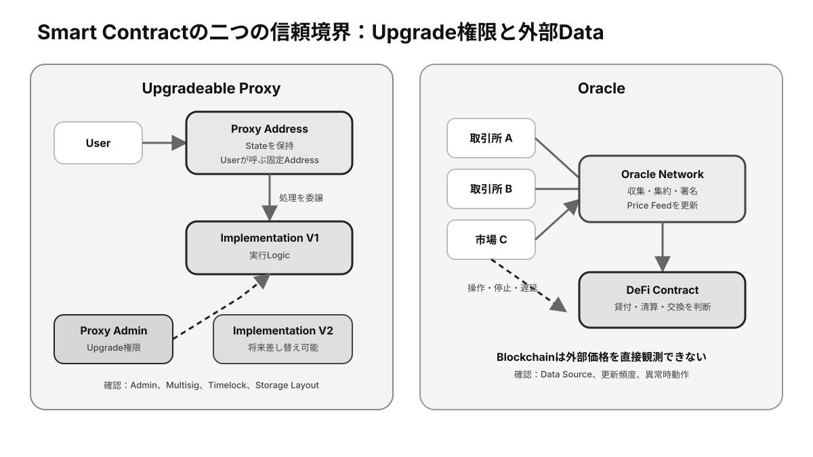

# 第10章 スマートコントラクト ★最重要

スマートコントラクトは、ブロックチェーン上で全ノードが同じ結果を検証できるプログラムです。本章ではコードと状態、読み取りと書き込み、Event、**Oracle**、アップグレードなど、利用時に必要な基本構造を説明します。

## この章の学習目標

- Code、State、Contract Address、ABIの関係を説明できる。
- ReadとWrite、Function InputとEvent / Receiptを区別できる。
- Upgrade、Oracle、外部Callに追加される信頼前提を評価できる。

> **最重要ポイント:** Smart Contractは「必ず正しい契約」ではなく、**配置されたCodeを決定論的に実行する仕組み**です。Codeの仕様・権限・入力が誤っていれば、誤った結果も一貫して実行します。

## 10.1 Smart Contract

### 10.1.1 Smart Contractとは

**Smart Contract**は、ブロックチェーンへ配置され、Transactionによって呼び出されるプログラムです。資産移転、Token、取引市場、投票などのルールをコードとして実行します。

「契約」という名称でも、法的契約と常に同一ではありません。コードが強制する処理と、現実世界で成立する権利義務の範囲を分けて確認します。

### 10.1.2 CodeとState

Codeは、入力に対してどの計算と状態変更を行うかを定義します。**State**は、残高、所有者、設定値など、そのContractが現在保持するデータです。

全ノードは同じCodeを同じ事前Stateへ適用し、同じ事後Stateへ到達します。結果がノードの環境によって変わらない設計が必要です。

### 10.1.3 Contract Address

**Contract Address**は、配置されたSmart Contractを識別する**オンチェーン**の宛先です。利用者はこのAddressへTransactionを送り、関数を呼び出します。

名前やロゴは容易に模倣できるため、利用前に公式情報と複数の信頼できる経路でAddressを照合します。同じCodeでも別Addressなら、異なるStateと管理権限を持つ別Contractです。

### 10.1.4 実行条件

Contractは、呼び出し元、入力値、時刻に相当するブロック情報、現在Stateなどを条件として処理を実行します。条件を満たさない場合は処理を失敗させ、状態変更を巻き戻せます。

ただし、Transaction Feeは計算資源の対価として消費されることがあります。事前シミュレーションと許容値設定で不要な失敗を減らします。

## 10.2 Contract Interaction

### 10.2.1 Read

Readは、Stateを変更せずContractのデータや計算結果を参照する操作です。通常はノードへローカル実行を依頼するため、署名やオンチェーンFeeを必要としません。

接続先ノードが誤った結果を返す可能性や、参照ブロックの違いは残ります。重要な値はブロック番号を固定し、複数の情報源で検証できます。

### 10.2.2 Write

Writeは、ContractのStateを変更する可能性がある関数呼び出しです。署名済みTransactionとして送信し、ブロックに収録されて初めて共有状態へ反映されます。

WriteにはFeeが必要で、実行順序やその時点のStateによって成功可否と結果が変わる場合があります。

### 10.2.3 Function

Functionは、Contractが外部へ提供する操作単位です。関数名、入力型、出力型、State変更の有無などはABIと呼ばれるインターフェース情報で表現されます。

公開関数であっても誰でも成功するとは限らず、内部で所有者やRoleの確認を行います。逆に、アクセス制御の実装漏れは重大な脆弱性になります。

### 10.2.4 Parameter

Parameterは関数へ渡す値で、宛先、数量、期限、許容価格などを指定します。単位や小数桁、Address、配列順序を誤ると、Transactionは有効でも意図しない結果になります。

ウォレットの確認画面で意味を解読できない場合は、無理に署名しません。信頼できるシミュレーションやContractの検証済みソースで内容を確認します。

### 10.2.5 Event

Eventは、Contractが実行中に出力する構造化ログです。アプリやExplorerはEventを監視し、Token移転、注文成立、設定変更などを効率よく索引化します。

EventはContractが発行するデータであり、Stateそのものではありません。重要な判定ではEventだけに依存せず、実際のStateとCodeの意味を確認します。

## 10.3 Smart Contractの性質

*図10-1：Smart Contractへ追加される二つの信頼境界――Upgrade権限と外部Data*

### 10.3.1 自動実行

Smart Contractは条件を満たすTransactionが送られると、ノードによって規則どおり実行されます。ただし、自ら時刻を監視して勝手に起動するわけではなく、通常は利用者や自動実行サービスからのTransactionが必要です。

「自動」は、実行開始後のルール適用が自動という意味であり、外部からの呼び出しやデータ供給まで不要になるわけではありません。

### 10.3.2 決定論

すべての検証ノードが同じ入力とStateから同じ結果を得る必要があります。そのため、通常のWeb APIや端末の現在時刻、予測不能な乱数へ直接依存できません。

外部情報や乱数が必要な場合は、Oracleや暗号学的な乱数提供方式など、合意可能な入力へ変換します。

### 10.3.3 不変性とアップグレード

配置済みCodeを直接変更できない設計は、後からルールを勝手に書き換えにくい利点があります。一方、バグ修正や機能追加が難しくなります。

Proxy ContractなどでStateとロジックを分離するとアップグレードできますが、管理鍵を持つ主体がCodeを変更できるリスクが生まれます。変更権限、待機期間、複数承認、停止機能を確認します。

### 10.3.4 外部データとOracle

Oracleは、価格、天候、試合結果など**オフチェーン**情報をオンチェーンで利用できる形に提供する仕組みです。Contractは現実世界を直接観測できないため、Oracleの正確性と更新性へ依存します。

複数データ源の集約、異常値除外、更新間隔、操作コスト、停止時の挙動を設計します。Oracleはブロックチェーン外部との信頼境界です。

### 10.3.5 Smart Contractの限界

Smart Contractは公開・決定論的な処理に強い一方、処理費用、スループット、プライバシー、外部情報取得に制約があります。Codeにバグがあれば、誤ったルールも忠実に実行します。

また、管理画面、フロントエンド、Oracle、鍵、ガバナンスなどContract外の要素もサービスの安全性を左右します。「Code is law」だけで全体を評価することはできません。

## 検定対策：Contractの読み方

### ABIとCall Data

ABI（Application Binary Interface）は、Function名、Parameter型、戻り値、Event形式を外部Toolへ伝える仕様です。Walletは人が指定したFunctionと値をABIでEncodeしてCall Dataへ変換し、Explorerは逆にDecodeして表示します。

ABIはInterfaceの説明であり、実際のCodeそのものではありません。悪意あるABIを使えば画面表示を誤解させられるため、**検証済みCodeから生成されたABIか**を確認します。

### ReadとWriteの比較

| 観点 | Read | Write |
|---|---|---|
| State変更 | しない | する可能性がある |
| 署名 | 通常不要 | 必要 |
| On-chain Fee | 通常不要 | 必要 |
| 実行場所 | 接続NodeのLocal実行 | Block内で全検証Nodeが実行 |
| 結果の確定 | 参照Blockに依存 | ReceiptとFinalityを確認 |

Readが無料でも、RPC Providerの利用料金やRate Limitは存在します。また、Write用FunctionをSimulationとしてLocal実行することはできますが、それは将来のBlockで同じ結果になる保証ではありません。

### Gasと計算資源

Smart Contractの各命令には計算Costが設定され、実行量をGas等の単位で測ります。上限がなければ無限Loopや重い処理でNodeを停止させられるため、Transactionごとの計算量を制限します。

Gas不足でRevertしても、そこまでの計算資源は消費されています。Storageへの書き込みは長期にわたりNodeが保持するため、単純計算より高Costになる設計が一般的です。

### Upgradeable Proxyの構造

Proxy方式では、利用者が呼ぶAddressとStateをProxyに保持し、実際のLogicをImplementation Contractへ委譲します。Implementation Addressを管理者が変更すると、同じProxy Addressのまま機能を更新できます。

利点はBug修正と機能追加ですが、管理者が悪意あるCodeへ差し替えるUpgrade Riskが生まれます。Storage Layoutの不整合で既存Stateを破壊する危険もあります。**Proxy、Implementation、Admin、Timelockをセットで確認します。**

### EventとStateの違い

Eventは検索しやすいLogですが、Contractの実行判断に直接読み戻せない設計が一般的です。StateはContractが次のTransactionで参照する保存値です。Eventだけを出しStateを変えないCodeも、Stateを変えてEventを出さないCodeも作れます。

監査・会計ではEventをIndexerで利用しつつ、重要残高はStateと照合します。

### 確認問題

1. Read操作はStateを変更しないため、Nodeの応答を一切検証する必要がない。正しいか。
2. Upgrade可能なContractで確認すべき主要権限を二つ挙げよ。
3. Eventが発生したことだけで、必ず期待するStateが存在すると断定できるか。

#### 解答と解説

1. **誤り。** 接続Node、参照Block、Chainを確認し、重要情報は複数SourceやProofで検証する。
2. **Proxy Admin / Upgrade権限、Timelock、複数署名、停止権限**など。
3. **断定できない。** EventはCodeが出力するLogであり、実際のStateとCode上の意味を照合する。

## まとめ

Smart ContractはCodeとStateを共有し、Transactionによって決定論的に実行されます。利用時はAddress、関数、Parameter、権限、アップグレード、Oracleを含め、オンチェーンとオフチェーンの信頼境界を確認する必要があります。
