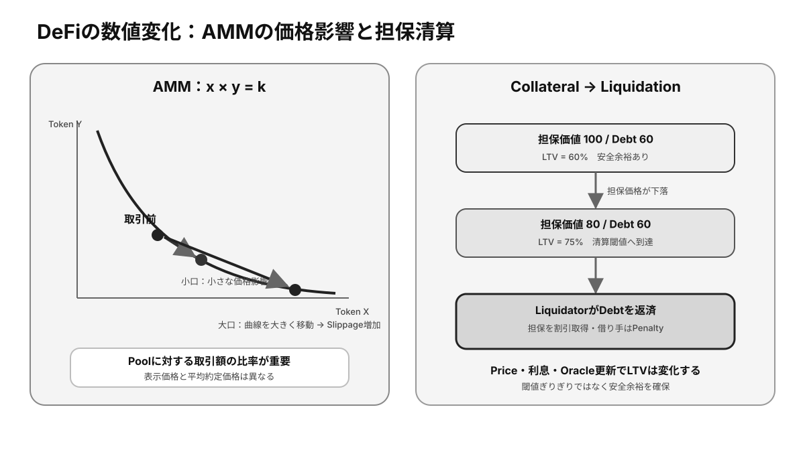

# 第12章 ステーキング・DeFiの基本原理

ステーキングと**DeFi**は、**Smart Contract**と経済的インセンティブを組み合わせた代表的なWeb3利用例です。本章では仕組みを理解し、表示利回りの背後にある役割とリスクを整理します。

## この章の学習目標

- Staking Rewardの原資と、Validator・Delegatorが負うRiskを説明できる。
- DEX、Lending、Liquidity Poolの基本的な資金移動を説明できる。
- APR / APY、Slippage、LTV、Liquidationを使って収益と損失条件を判断できる。

> **最重要ポイント:** 高い利回りは無条件の利益ではありません。**Rewardの原資と、誰がどのRiskを負担する対価なのか**を必ず確認します。

## 12.1 Staking

### 12.1.1 Stakingの目的

**Proof of Stake**における**Staking**は、資産を担保として合意形成へ参加し、ネットワークの安全性を維持する仕組みです。不正時に失い得る価値を設定することで、正しく行動する動機を作ります。

単に利息を得る預金ではなく、プロトコル運用への参加です。ロック期間、価格変動、**Slashing**、資金を預けるサービスの信用リスクを伴います。

### 12.1.2 Validator

**Validator**はブロック提案や投票を行い、稼働率と正しい動作に応じてRewardを得ます。ノード運用、署名鍵の保護、更新作業、監視が必要です。

利用者が運営サービスへ資産を預ける場合、**オンチェーン**のValidatorリスクに加え、事業者の**Custody Risk**が生じます。

### 12.1.3 Delegation

Delegationは、利用者が資産の経済的な重みをValidatorへ委任する仕組みです。自分でノードを運用せずに合意形成へ参加できます。

多くの場合、委任は資産の所有権移転とは異なりますが、チェーンやサービスによって設計が違います。Validatorの手数料、実績、分散性、解除待機期間を確認します。

### 12.1.4 Reward

Rewardは、新規発行、Transaction Fee、またはその組み合わせから支払われます。名目利回りが高くても、Tokenのインフレ率が高ければ保有比率の増加は小さいことがあります。

複利頻度、Validator手数料、税務上の扱い、解除までの価格変動を含めて評価します。

### 12.1.5 Slashing

Slashingは、二重署名などの規則違反に対してStakeを減らす罰則です。委任者も損失を分担する設計があるため、運営者の技術力とリスク管理が重要です。

停止による機会損失と、重大違反による元本削減は区別します。同じ障害で多数Validatorが同時に違反すると罰が大きくなる方式もあります。

## 12.2 DeFi

### 12.2.1 DeFiとは

DeFi（Decentralized Finance）は、交換、貸借、デリバティブなどの金融機能をSmart Contractで提供する仕組みです。Walletから直接利用でき、処理ルールと取引履歴をオンチェーンで検証できます。

「分散型」という名称でも、管理鍵、フロントエンド、**Oracle**、Stablecoin、開発チームへ依存する場合があります。分散性は機能ごとに評価します。

### 12.2.2 Smart Contractによる金融機能

Smart Contractは、預入、担保評価、利息計算、資産交換、清算を定められたCodeで実行します。複数Protocolを部品のように組み合わせられるComposabilityが特徴です。

一方、一つのProtocolの障害が依存先へ連鎖する可能性があります。監査済みであってもバグがない保証にはなりません。

### 12.2.3 DEX

DEX（Decentralized Exchange）は、Custodialな中央取引所へ資産を預けず、Smart Contractを通じて交換する仕組みです。注文板方式や**Liquidity Pool**を使う**AMM**方式があります。

利用者は価格影響、**Slippage**、Fee、Tokenの**Contract Address**、**Approval**を確認します。画面上の銘柄名だけを信用すると偽Tokenを交換する危険があります。

### 12.2.4 Lending

Lending Protocolでは、貸し手が資産をPoolへ供給し、借り手が担保を預けて借入れます。利率は需給に応じて変動し、Smart Contractが利息と担保率を管理します。

多くの**Permissionless** Lendingは信用情報ではなく過剰担保に依存します。担保価値が下がると自動清算され、Oracle異常や急変時には大きな損失が生じます。

## 12.3 Liquidity

*図12-1：AMMにおける取引量とSlippage、および担保価格下落からLiquidationまでの変化*

### 12.3.1 Liquidity

Liquidityは、価格を大きく動かさずに資産を売買できる度合いです。取引量だけでなく、現在価格付近で利用可能な資産量と市場の深さが重要です。

Liquidityが低い市場では、表示価格と実際の約定価格が大きく異なります。高い利回りが低Liquidityのリスクへの対価である場合もあります。

### 12.3.2 Liquidity Pool

Liquidity Poolは、複数資産をSmart Contractへ預け、利用者間の交換や貸借に使えるようにした資金集合です。提供者は取引Feeなどを受け取る代わりに市場リスクを負います。

AMM Poolでは価格変動により資産構成が自動的に変わり、単純保有より価値が低くなるImpermanent Lossが生じることがあります。

### 12.3.3 AMM

AMM（Automated Market Maker）は、Poolの残高と数式を使って交換価格を決めます。取引が一方へ偏るとPool内比率と価格が変化し、外部市場との裁定によって価格が近づきます。

数式、Fee、価格範囲はProtocolごとに異なります。集中Liquidityでは資本効率が上がる一方、範囲管理が必要です。

### 12.3.4 Slippage

Slippageは、注文時に期待した価格と実際の約定価格の差です。取引額がPoolに対して大きい場合、Liquidityが低い場合、市場が急変した場合に拡大します。

Slippage許容値を広げすぎると不利な約定や**MEV**の影響を受けやすくなり、狭すぎるとTransactionが失敗します。価格影響と許容値を分けて確認します。

### 12.3.5 Collateral / Liquidation

Collateralは借入れの返済を保証するために預ける担保です。担保価値に対する借入額の比率が基準を超えると、第三者が担保を割安に取得して負債を返済するLiquidationが実行されます。

利用者は最低基準ぎりぎりで借りず、価格変動、利息増加、Oracle更新、Network混雑を考慮した余裕を持たせます。清算ペナルティも事前に確認します。

## 検定対策：利回りをRiskへ分解する

### Staking形態の比較

| 形態 | 鍵・資産管理 | 利便性 | 主なRisk |
|---|---|---|---|
| Solo Staking | 自分で管理 | 運用知識が必要 | Slashing、停止、鍵管理 |
| Delegated Staking | 自分のWalletから委任 | Node運用不要 | Validator選定、解除待ち |
| Custodial Staking | 事業者へ預託 | 操作が簡単 | Custody、出金制限、事業者破綻 |
| Liquid Staking | Receipt Tokenを受領 | DeFiで再利用可能 | Smart Contract、価格乖離、再担保化 |

Liquid Staking TokenはStakeされた資産への請求権を表し、市場Priceが償還価値から乖離することがあります。さらにLendingへ預けると、Validator Risk、発行Protocol Risk、Lending Riskが重なります。

### APRとAPY

APRは単利換算の年率、APYはRewardを再投資する複利効果を含む年率です。名目年率を `r`、年内の複利回数を `n` とすると、単純化したAPYは `(1 + r/n)^n - 1` で表せます。

表示値は将来を保証せず、Token建てです。例えばToken数量が年10%増えても、そのToken価格が半減すれば法定通貨建て評価は減ります。**名目利回り、Inflation、Price変動、Feeを分けて計算します。**

### AMMの基本式

代表的なConstant Product AMMでは、Pool内の二資産量を `x` と `y` とし、手数料を無視すると `x × y = k` を保つよう交換Priceが変化します。大きなSwapほどPool比率を大きく変え、平均約定Priceが悪化します。

外部市場とのPrice差が生じるとArbitrage取引がPool比率を調整します。AMM自身が正しい外部Priceを知るのではなく、**裁定者の取引によって市場Priceへ近づく**仕組みです。

### Impermanent Loss

Liquidity Providerは、二資産の相対Priceが変化すると、単純に両方を保有した場合より評価額が低くなることがあります。これをImpermanent Lossと呼びます。Priceが元へ戻れば縮小し得ますが、引き出した時点で実現し、Tokenが無価値になれば回復しません。

取引FeeとIncentiveがImpermanent Loss、Contract Risk、資本拘束を上回るかを評価します。

### LTVとLiquidation

担保価値を100、借入を60とするとLTVは60%です。Liquidation Thresholdが75%なら、担保Price下落やDebt増加で75%へ達すると清算対象になります。安全余裕はThresholdとの差だけでなく、Oracle更新とNetwork混雑を考慮します。

清算者はDebtの一部を返済して担保をDiscountで受け取るため、借り手は清算Penaltyを負います。急落時にLiquidityが不足すると、ProtocolにBad Debtが残る可能性があります。

### 確認問題

1. APYが高いProtocolほど、安全性も高い。正しいか。
2. Constant Product AMMで大口取引ほどSlippageが大きくなる主な理由は何か。
3. 担保価値が下落するとLTVは一般にどう変化するか。

#### 解答と解説

1. **誤り。** 高利回りはInflation、低Liquidity、Leverage、Contract Risk等の対価である場合がある。
2. **Pool残高比率を大きく動かし、曲線上の平均約定Priceが悪化するため。**
3. **上昇する。** Debtが同じでも分母の担保価値が下がり、Liquidationへ近づく。

## まとめ

Staking Rewardはネットワーク安全性への参加対価であり、DeFi利回りはLiquidity、信用、価格変動、Contractなどのリスクを引き受ける対価です。利率だけでなく、資金の保管場所、損失条件、解除方法を理解して利用します。
