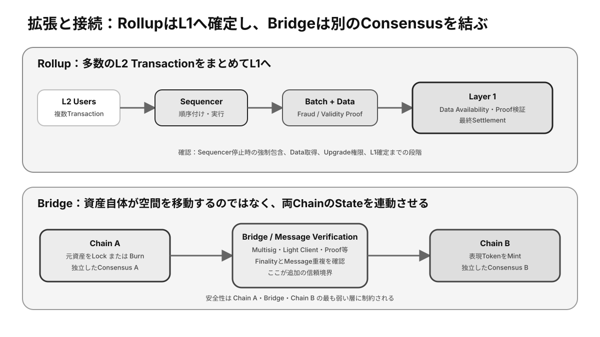

# 第13章 スケーラビリティとクロスチェーン

利用者が増えると、ブロックチェーンには処理量、待ち時間、Feeの課題が現れます。また、異なるチェーン間で資産や情報を移すには、新たな信頼境界が生まれます。本章では**Layer 2**とCross-chainの基本を整理します。

## この章の学習目標

- ScalabilityをTPSだけでなく、Finality、Fee、Node要件から評価できる。
- L1、L2、Rollup、Data Availability、Settlementの役割を説明できる。
- Bridge方式ごとに追加される信頼前提と資産の裏付けを判断できる。

> **最重要ポイント:** L2やBridgeは処理や接続を増やす一方、**Sequencer、Proof、Data Availability、Upgrade Key、中継者**など新しい信頼前提を追加します。

## 13.1 Scalability

### 13.1.1 処理能力

処理能力は、一定時間に処理できるTransaction数だけでなく、確定までの時間、計算量、データ量、状態の増加を含む概念です。単純な送金と複雑なContract実行では、一件当たりの負荷が異なります。

公表された最大TPSだけでは実利用時の性能を比較できません。Transactionの定義、負荷条件、**Finality**、ノード要件を合わせて見ます。

### 13.1.2 分散性とのトレードオフ

ブロックを大きくし生成を速めると処理量は増えますが、ノードに高性能な回線と機器が必要になります。参加コストが高まると、検証者が少数事業者へ集中する可能性があります。

性能、安全性、分散性を同時にどこまで満たすかが設計課題です。用途に応じて、どの性質を基盤層で保証し、どれを上位層へ移すかを選びます。

### 13.1.3 Layer 1

**Layer 1**（L1）は、**Consensus**、**Data Availability**、**Settlement**などを担う基盤Blockchainです。L1自体の改善には、実行方式、データ構造、並列処理、ブロック容量の変更などがあります。

L1変更は全ノードへ影響するため、安全性と互換性を保ちながら合意して導入する必要があります。

### 13.1.4 Layer 2

Layer 2（L2）は、L1の安全性やSettlementを利用しながら、Transaction実行の一部をL1外でまとめて処理する仕組みです。利用者当たりのFeeを下げ、処理量を増やすことを目指します。

L2ごとに、資産の入出金、データ公開、障害時の脱出、管理者権限、Finalityが異なります。「L2」という名称だけでL1と同じ保証になるわけではありません。

## 13.2 Layer 2の考え方

*図13-1：RollupがL1へSettlementする流れと、Bridgeが独立した二つのChainを接続する仕組み*

### 13.2.1 オフチェーン処理

**オフチェーン**処理では、多数のTransactionをL1へ一件ずつ記録せず、外部で実行して結果や証明をまとめてL1へ提出します。L1の限られたBlock領域を複数利用者で共有できます。

実行を外へ移しても、結果の正当性を検証し、利用者が資産を取り戻せる仕組みが必要です。

### 13.2.2 Rollup

**Rollup**は、Transactionデータや状態更新の情報をまとめ、L1へ公開・確定するL2方式です。Optimistic Rollupは不正があれば一定期間にProofを提出する方式、ZK Rollupは有効性を示す暗号学的Proofを提出する方式が代表的です。

両者は待機時間、証明計算、互換性、実装複雑性が異なります。実際の安全性にはSequencerやアップグレード権限も影響します。

### 13.2.3 Data Availability

Data Availabilityは、参加者が状態を再構成・検証するために必要なTransactionデータを取得できる性質です。正しい**State** Rootだけが示されても、元データが隠されれば独立検証や資産回収が困難になります。

データをL1に置くか、別のData Availability層へ置くかで、Feeと信頼前提が変わります。

### 13.2.4 Settlement

Settlementは、状態更新や紛争の最終結果を確定し、資産の所有関係を決める機能です。RollupはL1 ContractへState RootやProofを提出し、L1を最終的な裁定層として利用します。

L2上の「確定表示」とL1上の最終Settlementには時間差がある場合があります。大口入出金では両方の状態を確認します。

## 13.3 Cross-chain

### 13.3.1 異なるBlockchain間の通信

異なるBlockchainは、それぞれ独立したConsensusとStateを持ち、一方が他方の状態を自動的に理解するわけではありません。Cross-chain通信には、相手チェーンのEventや確定を検証してメッセージを中継する仕組みが必要です。

検証方法には、複数署名者、**Light Client**、暗号学的Proofなどがあり、信頼前提とコストが異なります。

### 13.3.2 Bridge

**Bridge**は、チェーン間で資産やメッセージを移動したように扱うProtocolです。実際には元チェーンの資産を保管し、移動先で対応Tokenを発行するなど、複数のContractと中継者が連携します。

利用者は対応チェーン、Token Address、Fee、Finality、管理者、監査、停止時の回収方法を確認します。

### 13.3.3 Lock / Mint

Lock / Mint方式では、元チェーンの資産をBridge ContractへLockし、その証明に基づいて移動先チェーンで表現TokenをMintします。表現Tokenの価値は、Lock資産と交換可能であることに依存します。

Lock資産が盗まれたりMint権限が侵害されたりすると、裏付けが失われます。総Mint量と保管量の整合性が重要です。

### 13.3.4 Burn / Mint

Burn / Mint方式では、移動元のTokenをBurnし、確認後に移動先で同量をMintします。複数チェーンで同一発行者がSupplyを統合管理するTokenなどで利用されます。

メッセージの偽造や再実行で不正Mintが起きないよう、各移動に一意な識別子と十分なFinality確認が必要です。

### 13.3.5 Cross-chain Risk

Cross-chainでは、複数チェーン、Bridge Contract、中継者、署名鍵、**Oracle**的なメッセージ検証が組み合わさり、攻撃面が増えます。一方のチェーン停止やReorgが他方へ波及することもあります。

Bridgeされた資産は元資産そのものではなく、Bridgeの償還能力に依存する請求権として捉えます。必要以上の額を長期間置かず、信頼前提を理解した経路を選びます。

## 検定対策：拡張方式の保証を比較する

### Scalabilityを測る複数指標

- **Throughput:** 一定時間に処理できるTransactionや計算量。
- **Latency:** 送信から初回収録までの時間。
- **Time to Finality:** 履歴が最終確定するまでの時間。
- **Cost:** 通常時と混雑時のFee。
- **Verification Cost:** Full Node運用に必要なCPU、Storage、Bandwidth。
- **State Growth:** 長期運用で増加するStateと履歴Data。

TPSを増やしてもNode要件が極端に上がり、少数Data Centerしか検証できなくなれば分散性は低下します。**利用者の処理性能と検証者の参加可能性を同時に見る**必要があります。

### Optimistic RollupとZK Rollup

| 観点 | Optimistic Rollup | ZK Rollup |
|---|---|---|
| 基本仮定 | 提出結果を一旦正しいとみなす | 有効性Proofを提出する |
| 不正対処 | Challenge期間にFraud Proof | L1がValidity Proofを検証 |
| L1への出金 | 待機期間が長い場合 | Proof確定後に短くできる場合 |
| 計算負荷 | Proof生成は比較的軽い設計 | Proof生成Costと複雑性 |
| 主要課題 | Watcher、Challenge、Data | Circuit、Prover、互換性 |

どちらも実装によって保証が異なります。Fraud ProofやValidity Proofが存在しても、Adminが即時Upgradeできる場合やDataが取得不能な場合は追加Riskがあります。

### Sequencer

SequencerはL2 Transactionを受け付け、順序付けてBatch化する役割です。単一Sequencerは低Latencyを実現しやすい反面、停止、検閲、MEV、順序操作のRiskがあります。

強制包含機能があれば、Sequencerが検閲しても利用者がL1経由でTransactionを取り込ませられます。ただし時間とL1 Feeが必要です。**停止時の脱出経路が実際に利用可能か**を確認します。

### Bridgeの信頼モデル

| 検証方式 | 信頼対象 | 特徴 |
|---|---|---|
| Multisig / Committee | 署名者の閾値 | 実装しやすいが鍵集中Risk |
| Light Client | 相手ChainのConsensus Proof | 信頼最小化しやすいが高Cost・複雑 |
| Optimistic Verification | 不正を監視するWatcher | Challenge期間とData Availabilityが必要 |
| Validity Proof | Proof Systemと検証Contract | 強い検証性、実装・Circuit Risk |

BridgeされたTokenを持つことは、元ChainのLock資産または発行者に対する償還請求を持つことです。Bridgeが破綻すれば、移動先Tokenが存在しても裏付けを失います。

### Finalityの組み合わせ

Cross-chain Messageを安全に処理するには、元Chainで十分確定してから移動先で実行します。元Chain、Bridge、移動先Chainの三層があり、最終的な安全性は最も弱い層に制約されます。

### 確認問題

1. L2で表示された即時確定は、常にL1 Settlement完了と同じである。正しいか。
2. Data Availabilityが失われると、Rollup利用者にどのような問題が起きるか。
3. Multisig Bridgeの主な信頼対象は何か。

#### 解答と解説

1. **誤り。** Sequencer確認、L2確定、L1 Batch提出、Challenge / Proof完了は別段階。
2. **State再構成、独立検証、資産引き出しに必要なDataを得られなくなる可能性。**
3. **必要閾値未満の署名者が不正・侵害されないこと。** 鍵管理と運営主体の独立性を評価する。

## まとめ

Scalabilityは処理を増やすだけでなく、検証可能性と分散性を維持する課題です。L2はL1の機能を一部利用して拡張し、Bridgeは独立チェーン間へ新しい信頼関係を作ります。性能向上の代わりに増えた前提を必ず確認しましょう。
