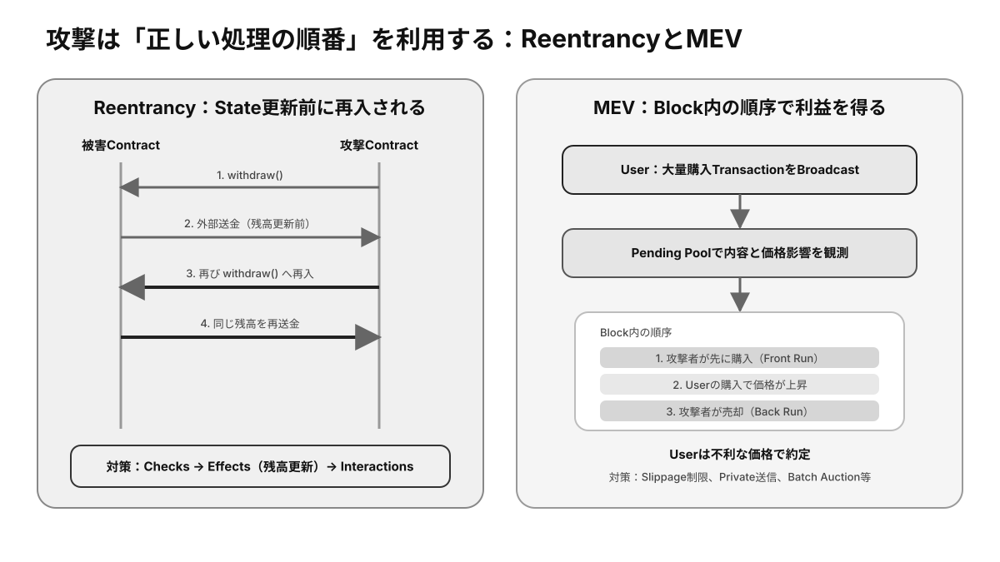

# 第14章 Web3セキュリティ ★最重要

Web3では、正しい署名で実行されたTransactionを後から取り消すことが難しく、利用者自身がセキュリティ境界の一部になります。本章では、鍵と署名、**Smart Contract**、**Consensus**や**Bridge**に分けてリスクと対策を整理します。

## この章の学習目標

- User、Wallet、Contract、Oracle、Consensus、Bridgeごとに脅威を分類できる。
- 予防・検知・対応・復旧の各段階へControlを配置できる。
- 事故時に資産と証拠を守り、二次被害を防ぐ初動を説明できる。

> **最重要ポイント:** Securityは一つの製品で完成しません。**単一障害点を減らし、侵害されても権限・金額・時間で被害を限定する多層防御**が必要です。

## 14.1 セキュリティの基本

### 14.1.1 秘密鍵漏洩

**秘密鍵**や**Seed Phrase**が漏れると、攻撃者は正規の署名を作成でき、ネットワークは本人と区別できません。クラウド保存、スクリーンショット、マルウェア、偽サポート、廃棄端末などが漏洩経路になります。

高額資産はHardware Walletや複数署名で日常端末から分離し、復元情報をオフラインで保管します。漏洩が疑われたら、侵害されていない環境で新しいWalletを作り、資産と権限を移します。

### 14.1.2 Phishing

**Phishing**は、公式サイトや運営者を装い、Seed Phrase、ログイン情報、署名をだまし取る攻撃です。検索広告、SNSの返信、DM、偽アプリ、似たドメインがよく使われます。

ブックマークや公式の複数経路からURLを確認し、Seed PhraseをWebへ入力しません。「緊急」「今だけ」「サポートが復元する」といった心理的圧力があれば操作を止めます。

### 14.1.3 誤署名

誤署名は、内容を理解せずにTransactionやMessageへ署名し、Token移転権限や資産操作権を攻撃者へ与える問題です。FeeがゼロのMessage署名でも、認証や注文として悪用される場合があります。

宛先、チェーン、金額、関数、**Approval**量、期限を確認し、解読できないBlind Signingを避けます。用途別Walletと低残高Walletで被害範囲を分離します。

### 14.1.4 誤送金

誤送金には、Addressの入力ミス、異なるChainへの送付、誤ったToken、MemoやTagの不足があります。有効なTransactionとして確定すると、管理者が取り消せないことが一般的です。

Addressは先頭と末尾だけでなくコピー元を確認し、Address Poisoningに注意します。初回や高額送金では少額テストを行い、取引所の対応Networkと入金条件を照合します。

## 14.2 Smart Contract Risk

*図14-1：外部Call中の再入と、Block内のTransaction順序を利用する二つの攻撃パターン*

### 14.2.1 Access Control

Access Controlは、管理関数や資産移動を許可された主体だけに制限する仕組みです。実装漏れ、Role設定ミス、初期化忘れ、単一管理鍵の漏洩は、Contract全体の乗っ取りにつながります。

所有者、Proxy管理者、停止・Mint・資産回収権限を確認します。複数署名、Timelock、最小権限、監視によって影響を抑えます。

### 14.2.2 Business Logic

Business Logicの脆弱性は、Codeが仕様どおり動いても、その仕様の抜け道で不正利益を得られる問題です。価格計算、端数処理、担保評価、報酬、状態遷移の境界条件などに現れます。

単体関数だけでなく、複数機能や他Protocolを組み合わせた振る舞いを検証します。テスト、形式検証、第三者レビュー、経済モデル検証が必要です。

### 14.2.3 Reentrancy

**Reentrancy**は、Contractが外部Contractを呼び出している途中に、相手から元の関数へ再入され、不整合な状態で処理が繰り返される脆弱性です。残高更新前に送金すると、同じ残高を複数回引き出される可能性があります。

状態を先に更新してから外部呼び出しを行う、再入防止Lockを使う、引き出し方式を分離するなどで対策します。

### 14.2.4 Oracle Risk

**Oracle** Riskは、外部価格や事象の誤り、遅延、操作、停止がContractへ誤った判断をさせるリスクです。Liquidityの薄い市場価格を参照すると、短時間の資金で価格を操作されることがあります。

複数Source、時間加重平均、更新の鮮度、変動上限、異常時停止を組み合わせます。Oracleが止まったときに安全側へ動く設計も重要です。

### 14.2.5 External Call

External Callは、別ContractのCodeを実行するため、制御が一時的に外部へ移ります。相手が失敗する、予想外の値を返す、過大な計算資源を使う、再入する可能性を想定します。

戻り値と失敗を明示的に処理し、信頼できないCall先を限定します。依存先Contractのアップグレードも自分のProtocolの挙動を変え得ます。

## 14.3 Blockchain特有のリスク

### 14.3.1 Consensus Attack

Consensus Attackでは、計算力やStakeの大きな割合を支配し、取引の検閲、順序変更、最近の履歴の再編を試みます。攻撃者でも通常は他者の署名を偽造できませんが、確定前取引の信頼性を下げられます。

十分なConfirmationや**Finality**を待ち、**Validator**や計算力の集中度を監視します。小規模Chainほど攻撃資源を借りやすい場合があります。

### 14.3.2 Front Running / MEV

Front Runningは、未確定Transactionを観測した者が高い優先Feeなどで先にTransactionを入れ、価格変動や権利取得から利益を得る行為です。**MEV**は、Block内のTransaction選択・順序・追加から得られる価値の総称です。

DEXでは**Slippage**設定、Privateな送信経路、Commit-Reveal、Batch Auctionなどで影響を減らせます。完全な排除ではなく、公平性と効率の設計課題です。

### 14.3.3 Bridge Risk

Bridgeは複数Chainの状態を検証する必要があり、多額のLock資産と強いMint権限が攻撃対象になります。署名者の乗っ取り、検証不備、Contractバグ、元ChainのReorgが不正発行につながります。

資産を長期保管せず、信頼モデル、署名閾値、監査、Bug Bounty、緊急停止、過去の障害対応を確認します。

### 14.3.4 Protocol Risk

**Protocol Risk**は、仕様、Code、経済設計、ガバナンス、依存先の問題によって仕組み全体が期待どおり機能しないリスクです。監査済みでも未知のバグや市場急変は残ります。

利用期間、預入総額、管理権限、依存関係、変更履歴を調べ、複数Protocolへ分散します。ただし、同じStablecoinやOracleに依存していれば見かけ上の分散にすぎません。

### 14.3.5 Human Error

Human Errorには、設定ミス、誤ったアップグレード、鍵紛失、権限付与、手順省略、偽情報への反応があります。技術的に安全なContractでも、運用者と利用者の操作で事故は起こります。

チェックリスト、複数人承認、変更前シミュレーション、送金上限、段階的展開、緊急対応訓練で、ミスを前提に被害を限定します。

## 検定対策：脅威分析とIncident Response

### 攻撃対象と代表的Control

| 層 | 代表的脅威 | 予防 | 検知・対応 |
|---|---|---|---|
| User | Phishing、誤操作 | 教育、手順、用途別Wallet | 署名通知、緊急連絡 |
| Endpoint | Malware、Clipboard改ざん | Hardware Wallet、更新 | EDR、Address照合 |
| Key | 漏洩、紛失 | Multisig、MPC、Offline Backup | 異常署名監視、鍵交換 |
| Contract | Bug、Access Control | Review、Test、Audit | Pause、Timelock、Monitoring |
| Oracle | Price操作、停止 | 複数Source、上限 | Freshness監視、安全側停止 |
| Protocol | Economic Attack | Limit、担保余裕 | Circuit Breaker、清算監視 |
| Infrastructure | DNS / RPC侵害 | 複数Provider、署名配布 | Integrity監視、代替経路 |
| Governance | 悪意あるUpgrade | Quorum、Timelock | 提案監視、緊急拒否 |

Audit済みという表示は、特定時点・特定ScopeのCodeを専門家が確認した証拠です。Audit後のUpgrade、Scope外のFrontend、経済設計、運用鍵は別に評価します。

### Threat Modelingの手順

1. 保護対象となる資産、鍵、権限、Dataを列挙する。
2. UserからState更新までのData FlowとTrust Boundaryを描く。
3. 各BoundaryでSpoofing、改ざん、権限昇格、停止などを想定する。
4. 起こりやすさと最大損失から優先度を決める。
5. 予防、検知、封じ込め、復旧のControlを配置する。
6. Upgradeや依存先変更のたびに見直す。

**「攻撃を完全に防ぐ」だけでなく、「攻撃されても全資産を一度に失わない」設計**が重要です。

### Flash LoanとEconomic Attack

Flash Loanは、一つのTransaction内で借入れと返済を完了する無担保借入れです。正当な裁定や資本効率化に使えますが、一時的に巨大な資金を得てOracle PriceやGovernance投票、Pool比率を操作する攻撃にも利用されます。

Flash Loan自体が脆弱性ではありません。Protocolが「攻撃者は大資金を持てない」と仮定していることが問題です。Priceには操作しにくい時間平均や複数市場を利用します。

### Incident Response

1. **検知:** 異常なTransfer、Admin変更、Price乖離を確認する。
2. **封じ込め:** Pause、Rate Limit、Frontend停止、鍵権限失効を実施する。
3. **保全:** Tx Hash、Block、Log、端末記録、時刻を保存する。
4. **分析:** Key漏洩、Contract Bug、Oracle異常など原因を切り分ける。
5. **Recovery:** 安全な新ContractやWalletへ資産・権限を移す。
6. **通知:** 利用者、取引所、Bridge、関係機関へ事実と対応を共有する。
7. **再発防止:** Root CauseとControl不足を検証し、段階的に再開する。

攻撃者へ気付かれる前に封じ込める必要がある一方、証拠を消す性急な操作は調査を妨げます。事前に権限と連絡経路を決めておきます。

### 確認問題

1. Audit済みContractは安全性が保証され、追加監視は不要である。正しいか。
2. Reentrancy対策の代表的な処理順序を述べよ。
3. Private Key漏洩が疑われる際、元のWallet内でPasswordだけを変更すれば十分か。

#### 解答と解説

1. **誤り。** Auditは範囲と時点が限定され、未知のBug、Upgrade、運用Riskは残る。
2. **Checks → Effects → Interactions。** 条件確認、内部State更新、外部Callの順に行う。
3. **不十分。** 新しい安全な鍵へ資産と権限を移し、古い鍵を無効化または利用停止する。

## 実践チェックリスト

- URL、Chain、**Contract Address**を複数の信頼できる情報源で照合する。
- 署名前に宛先、金額、関数、Approval、期限を確認する。
- 日常用、保管用、検証用Walletを分け、必要最小限の残高にする。
- 高額操作では少額テストと別担当者による確認を行う。
- 管理権限、アップグレード、Oracle、Bridge、依存Protocolを調べる。
- 事故時に資産を移す宛先と、連絡・停止・証拠保存の手順を用意する。

## まとめ

Web3セキュリティでは、秘密鍵だけでなく、署名内容、Contract、Oracle、Bridge、Consensus、運用まで連続した攻撃経路として考えます。侵害を完全に防ぐだけでなく、権限と資産を分離し、一つの失敗による最大損失を小さくすることが重要です。
