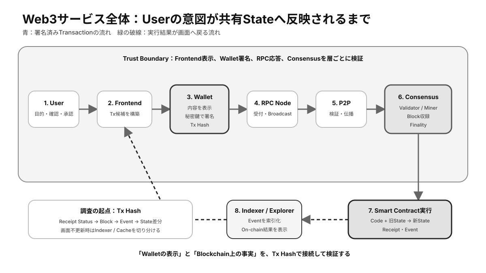

# 第15章 Web3の実務・リスク・総合理解

最終章では、これまで学んだ要素を一つのWeb3サービスと一件のTransactionへ結び付けます。利用者の画面操作から状態更新までを追跡し、どの地点にどのリスクが存在するかを総合的に判断します。

## この章の学習目標

- Web3サービスをUser、Wallet、Infrastructure、Blockchain、Contractへ分解できる。
- Tx Hashを起点に、署名からState更新までの事実を追跡できる。
- Custody、Contract、Protocol、Operational Riskを重複なく整理し、対策を選べる。

> **最重要ポイント:** 実務では「Blockchainだから安全」と判断せず、**各層の信頼対象、失敗条件、最大損失、復旧経路**を明確にします。

## 15.1 Web3サービスの構造

*図15-1：Userの操作が署名、Network、Consensus、Contract実行を経て画面へ反映されるまで*

### 15.1.1 User

Userは、目的を決め、WebアプリやWalletを通じて操作する主体です。技術的にはAddressと署名で表現されますが、実務では本人確認、組織内権限、会計・税務、利用規約などの**オフチェーン**要件も関わります。

User自身がURL、Chain、Address、Transaction内容を確認する必要があります。操作の分かりにくさは単なるUX問題ではなく、セキュリティリスクです。

### 15.1.2 Wallet

Walletは、Userの意図をTransactionへ変換し、鍵で署名する境界です。接続要求、Chain切替、残高表示、シミュレーション、署名確認を提供します。

Walletが正しくても、Userが不正な内容を承認すれば有効な署名になります。保管用と利用用を分け、Hardware Walletの画面で最終確認します。

### 15.1.3 Blockchain

Blockchainは、Transactionを順序付けて検証し、共有**State**を更新する基盤です。履歴の公開性、**Finality**、Fee、処理量、障害耐性はChainごとに異なります。

サービスが複数ChainやL2に対応する場合、同じAddress表記でも資産と状態は別です。どのChainが最終的な**Settlement**を担うかを確認します。

### 15.1.4 Smart Contract

**Smart Contract**は、サービスの**オンチェーン**ルールと資産管理を実装します。Userからの入力に基づき、権限、残高、価格、期限などを確認して決定論的にStateを変更します。

**Contract Address**、検証済みCode、監査、管理者、アップグレード、停止機能、**Oracle**を調べます。フロントエンドの説明とCodeの挙動が一致するとは限りません。

### 15.1.5 Node / Infrastructure

NodeとInfrastructureは、Walletやアプリからの照会を受け、TransactionをNetworkへ中継します。RPC、Indexer、Explorer、フロントエンド配信、DNSなどが利用体験を支えます。

これらが停止・改ざんされてもBlockchain自体は動き続ける場合がありますが、Userは正しい情報へ到達できなくなります。代替RPC、複数Explorer、検証可能なデプロイ情報が重要です。

## 15.2 Transactionを追跡する

### 15.2.1 Walletで署名

Userが操作すると、アプリはWalletへTransaction候補を渡します。WalletはChain ID、宛先、Value、Fee、入力データを表示し、Userの承認後に**秘密鍵**で署名します。

この時点の確認が最も重要です。画面表示と署名対象が正しいか、**Approval**が過大でないか、シミュレーション結果が期待どおりかを確認します。

### 15.2.2 NetworkへBroadcast

署名済みTransactionはRPC Nodeへ送られ、P2P Networkを通じて伝播します。Nodeは形式と署名などを検証し、有効なら未確定Poolへ入れます。

UserはTx Hashを受け取り、Explorerや別RPCで伝播状況を追跡できます。アプリ画面が停止しても、Tx Hashがあればオンチェーン状態を独立確認できます。

### 15.2.3 Nodeによる検証

各Nodeは、署名、Nonce、残高、Fee、Contract実行結果を共通ルールで検証します。条件を満たさないTransactionはBlock候補にならず、実行中に失敗した場合は意図したState変更が反映されません。

UserはReceipt、Status、使用Fee、Event、内部Callを確認し、単にBlockへ入ったことと成功を区別します。

### 15.2.4 Consensus

**Validator**または**Miner**がTransactionを含むBlockを提案し、**Consensus**規則に従って正規Chainへ追加します。後続BlockやValidator投票によってFinalityが高まります。

サービスは取引金額とChainの特性に応じ、何Confirmationで入金や処理を確定するかを定めます。速い画面反映と最終確定は同じではありません。

### 15.2.5 State更新

確定したBlock内のTransactionを順に実行した結果、残高やContract Stateが更新されます。Eventが発行されるとIndexerが読み取り、アプリ画面へ新しい状態を表示します。

画面が更新されない場合は、ReceiptとオンチェーンStateを先に確認し、次にIndexerやキャッシュの遅延を疑います。事実の源泉を層ごとに切り分けます。

## 15.3 Web3におけるリスク判断

### 15.3.1 TrustとVerification

実務では、すべてを自分で検証することは困難です。重要なのは、どの情報を誰から得ており、どこまで暗号学的または複数Sourceで検証できるかを明示することです。

例えばBlock InclusionはProofで検証できても、Tokenが現実資産に裏付けられているかは発行者や監査へ依存します。「Don't trust, verify」を、検証可能範囲の把握として実践します。

### 15.3.2 Custody Risk

**Custody Risk**は、資産操作に必要な鍵を管理する主体が、停止、破綻、侵害、内部不正、規制対応によって資産を返せなくなるリスクです。取引所、**Bridge**、管理型**Staking**、ラップ資産に現れます。

誰が鍵を持つか、複数承認か、資産が分別管理されるか、出金条件と法的保護は何かを確認します。Self-Custodyではこのリスクが鍵紛失と誤操作のリスクへ置き換わります。

### 15.3.3 Smart Contract Risk

Smart Contract RiskにはCodeのバグ、仕様の欠陥、管理権限、Upgrade、Oracle、外部Callがあります。監査は有力な材料ですが、無事故の保証ではありません。

預入額、稼働期間、Bug Bounty、変更履歴、依存関係、管理者の対応能力を確認し、一度に許容できる損失額だけを利用します。

### 15.3.4 Protocol Risk

**Protocol Risk**は、個別Contractを超えた経済設計と仕組み全体のリスクです。担保価格急落、Stablecoinの乖離、Liquidity枯渇、Governance攻撃、Consensus障害が含まれます。

平常時の利回りだけでなく、極端な市場条件で誰が損失を負担し、どの順序で停止・清算・回収されるかを調べます。

### 15.3.5 Operational Risk

**Operational Risk**は、鍵管理、送金手順、権限設定、監視、会計、緊急対応など日常運用の失敗です。複雑な仕組みでは、小さな設定ミスが取り消せない損失になります。

担当者と承認基準を決め、複数人確認、送金上限、Address Allowlist、少額テスト、ログ保存、定期的な復旧訓練を行います。手順は作るだけでなく、実行可能か検証します。

## 検定対策：Due DiligenceとRisk評価

### サービス利用前のDue Diligence

| 調査項目 | 確認内容 | 主な情報源 |
|---|---|---|
| Identity | 公式URL、Chain、Contract Address | 公式Document、複数公式Channel |
| Code | 検証済みCode、Audit、Bug Bounty | Explorer、Audit Report |
| Control | Admin、Upgrade、Pause、Mint権限 | Contract、Governance Document |
| Asset | Custody、裏付け、償還条件 | Reserve Report、On-chain Data |
| Dependency | Oracle、Bridge、Stablecoin、Frontend | Architecture、Code、Incident履歴 |
| Economics | Reward原資、担保、清算、Liquidity | Parameter、Dashboard、State |
| Operations | 緊急対応、連絡、変更手順 | Runbook、Governance Forum |

情報が見つからないこと自体もRisk Signalです。TVL、利用者数、著名投資家は参考情報ですが、Codeと資産保全の代わりにはなりません。

### Riskの定量化

簡易的には `Risk = 発生可能性 × 影響度` としてHigh / Medium / Lowへ分類します。さらに、検知までの時間、回復可能性、他Serviceとの相関を加えます。

例えば、少額の日常WalletのPhishingは発生可能性が高くても影響額を限定できます。一方、組織のTreasury Admin Keyは利用頻度が低くても、漏洩時の影響が極めて大きいためMultisigとTimelockを使います。

### Risk分類の比較

| Risk | 中心となる問い | 代表例 |
|---|---|---|
| Custody | 誰が鍵と償還資産を持つか | 取引所、Bridge保管、Custodian |
| Smart Contract | CodeとAdmin権限は正しいか | Bug、Upgrade、Oracle Call |
| Protocol | 経済設計が極端条件で耐えるか | Bank Run、清算不足、Governance Attack |
| Market | PriceとLiquidityが変化したらどうなるか | Slippage、Depeg、Volatility |
| Operational | 人と手順が正しく動くか | 誤送金、鍵紛失、設定ミス |
| Regulatory / Legal | 権利と義務を執行できるか | Tokenの法的位置付け、制裁、税務 |

Riskは重なります。BridgeされたStablecoinをLendingへ預ける場合、発行者、Bridge、Lending Contract、Oracle、担保市場、Wallet運用のRiskが同時に存在します。

### Transaction調査のEvidence Level

1. **Wallet表示:** 最も手軽だがCacheやRPC依存がある。
2. **Explorer表示:** On-chain Dataを見やすくしたもの。Labelは外部情報。
3. **複数RPC / Explorer照合:** 単一Providerの誤りを減らす。
4. **自前Full Node:** Protocol規則を独立検証する。
5. **Cryptographic Proof:** Inclusion、State、Finalityに関するProofを検証する。

金額と業務重要度に応じてEvidence Levelを上げます。全件を最高Levelで確認するのではなく、Risk Based Approachを採用します。

### 総合ケーススタディ：DEXでTokenを交換する

1. 公式情報からアプリのURL、利用Chain、Token Contract Addressを確認する。
2. 日常用Walletを接続し、交換額、PoolのLiquidity、価格影響、**Slippage**、Feeを確認する。
3. 必要量だけToken Approvalを行い、Tx Hashと確定結果を確認する。
4. Swap Transactionをシミュレーションし、最低受取額、宛先、期限を確認して署名する。
5. ExplorerでStatus、実際の受取量、Fee、Eventを確認する。
6. 不要になったApprovalをRevokeし、取引記録と取得時価格を保存する。

この一連の操作には、Walletの鍵管理、RPCの可用性、DEX Contract、Token Contract、Liquidity、**MEV**、利用ChainのConsensusが関わります。問題発生時にどの層を調べるかを意識すると、原因と対応を切り分けられます。

### 総合確認問題

1. WalletにSuccessと表示されたがToken残高が増えない。調査順序を述べよ。
2. 高利回りのBridged TokenをLendingへ預ける場合のRiskを三つ以上挙げよ。
3. Upgradeable Contractを利用する際、Code Hashだけで安全性を判断できない理由は何か。
4. Self-Custodyに切り替えるとCustody Riskは完全に消えるか。
5. Trustlessな設計を評価する際、検証可能性以外に確認すべきものを二つ挙げよ。

#### 解答と解説

1. **ChainとTx Hashを確認し、Receipt Status、Event、State差分、Indexer / Wallet Cacheの順に調べる。**
2. **Bridge Risk、Token発行者・償還Risk、Lending Contract、Oracle、Liquidity、Liquidation、Wallet鍵管理**など。
3. **AdminがImplementationを変更でき、将来のCodeと権限が変わるため。** Proxy、Implementation、Admin、Timelockを見る。
4. **消えない。** 第三者Custodyは減るが、鍵紛失、漏洩、誤署名というSelf-Custody Riskへ移る。
5. **管理権限、外部Data、停止時の脱出、Governance、Infrastructure依存**など。

## 最終チェックリスト

- 資産と権限を誰が管理しているか説明できる。
- Transactionの署名、送信、成功、Finalityを区別できる。
- ExplorerでAddress、Tx Hash、Block、Eventを相互に確認できる。
- Contractの管理者、Upgrade、Oracle、外部依存を確認できる。
- 利回りの原資と、損失が生じる条件を説明できる。
- 自分が許容できる最大損失に合わせて資産・Wallet・Protocolを分散している。
- 誤送金、鍵漏洩、Protocol停止時の対応手順を用意している。

## まとめ

Web3サービスは、User、Wallet、Infrastructure、Blockchain、Smart Contractが連携する多層システムです。各層の役割と信頼境界を理解し、Tx Hashを起点に事実を検証し、技術・経済・運用のリスクを分けて判断できれば、個別サービスが変わっても応用できます。
