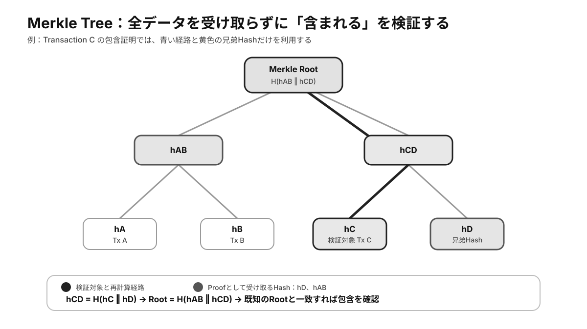

# 第2章 ブロックチェーンの基本構造

ブロックチェーンは、複数の参加者が同じ履歴を共有し、その履歴が途中で変更されていないことを検証できるように設計されたデータ構造です。ただし、単に取引を時系列に並べただけでは、ブロックチェーンにはなりません。取引を一定の単位へまとめる**ブロック**、前後のブロックを結び付ける**ハッシュ参照**、多数の取引を効率よく要約する**Merkle Tree**、そしてどの履歴を正しいものとして採用するかを決める**コンセンサス**が組み合わさることで、共有可能で検証可能な台帳が成立します。

本章では、ブロックチェーンを構成する基本的な部品を順番に確認します。特定のチェーンに固有の項目を暗記するのではなく、なぜ取引をブロックへまとめるのか、どのように履歴を連結するのか、何が改ざんを検知し、何が履歴の書き換えを困難にするのか、という普遍的な仕組みを理解することが目的です。

## 2.1 ブロックという記録単位

### 2.1.1 なぜ取引をブロックへまとめるのか

ブロックチェーンでは、利用者が送信した取引を一件ずつ独立して確定するのではなく、一定数または一定期間分の取引をまとめて処理する方式が広く採用されています。この取引のまとまりがブロックです。

取引をブロックへまとめる理由の一つは、複数の取引へ共通の順序を与えやすくするためです。分散ネットワークでは、各ノードが同じ取引をまったく同じ時刻に受け取るとは限りません。通信経路や距離によって到着順序が異なるため、単に「先に届いた取引」を正しい順序とすることはできません。そこで、一定のルールに従って選ばれた取引群を一つのブロックとして提案し、そのブロックの位置をネットワーク全体で共有します。

もう一つの理由は、検証と保存の単位を作るためです。ブロックごとに取引集合の要約値や前のブロックへの参照を持たせることで、履歴全体を順序付きの構造として確認できます。これは帳簿のページに似ていますが、各ページが前のページの内容に暗号学的に結び付いている点が通常の帳簿と異なります。

### 2.1.2 ブロックに含まれる情報

一般的なブロックは、大きく分けて**ヘッダー**と**本体**から構成されます。ブロック本体には取引の一覧が含まれ、ヘッダーにはそのブロックを識別し、前後関係や内容を検証するための情報が含まれます。

代表的なヘッダー情報には、次のようなものがあります。

- 直前のブロックを参照する値
- ブロック内の取引集合を要約する値
- ブロックの生成時刻に関する情報
- ブロックの位置やバージョンに関する情報
- 合意形成に必要な情報

ただし、ヘッダーの具体的な項目や名称はチェーンごとに異なります。Proof of Workを採用するチェーンでは計算競争に関する値を含む場合があり、Proof of Stakeを採用するチェーンでは提案者や署名、投票に関する情報を別の形で扱う場合があります。重要なのは、すべてのブロックチェーンが同一形式のヘッダーを持つことではなく、**ブロックの内容、前後関係、有効性を検証するための情報を持つ**という共通点です。

### 2.1.3 トランザクションと状態変更

ブロック内に含まれるトランザクションは、ブロックチェーンの状態を変更する要求です。単純な資産移転だけでなく、スマートコントラクトの実行、権限の更新、データの登録などもトランザクションとして表現できます。

ノードは、受け取ったトランザクションについて、署名が有効か、送信者に必要な残高や権限があるか、同じ資産が二重に使われていないか、プロトコルの形式に従っているか、といった点を検証します。形式上有効なトランザクションであっても、ネットワークへ送信された時点ではまだ確定していません。ブロックに取り込まれ、そのブロックが正規の履歴として受け入れられることで、初めて共有台帳の状態へ反映されます。

したがって、トランザクションには少なくとも三つの段階があります。

1. 利用者が作成し、署名した段階
2. ネットワークへ伝播し、ノードが検証している段階
3. ブロックに含まれ、履歴として確定していく段階

この区別は、後の章で扱う未確定取引、確認数、ファイナリティを理解する前提になります。

### 2.1.4 ブロックの識別

多くのブロックチェーンでは、ブロックヘッダーをハッシュ関数へ入力して得られる値を、ブロックの識別子として利用します。この値は一般にブロックハッシュと呼ばれます。

ハッシュ関数には、入力が少し変わるだけで出力が大きく変化する性質があります。そのため、同じ位置にあるように見えるブロックでも、含まれる取引やヘッダー情報が異なれば、別のブロックとして識別できます。

一方、ブロック高やブロック番号は、チェーン上の位置を表す値です。起点から数えて何番目の位置にあるかを示すため、人間が履歴を追う際には便利ですが、必ずしもブロックを一意に識別するものではありません。一時的な分岐が生じた場合、同じ高さに異なるブロックが存在することがあります。その場合、位置を示すブロック高と、内容を識別するブロックハッシュを区別する必要があります。

## 2.2 ブロックが連結される仕組み

### 2.2.1 前のブロックへの参照

各ブロックは、通常、直前のブロックを示すハッシュ値を持ちます。この値はPrevious Block HashやParent Hashなどと呼ばれます。新しいブロックが前のブロックのハッシュを含むことで、履歴は順序付きのチェーンとして連結されます。

ここで重要なのは、単に「前の番号」を記録しているのではなく、**前のブロックの内容に基づいて計算された値**を記録していることです。過去のブロック内にある取引を一つ変更すると、そのブロックの要約値やヘッダーが変わり、結果としてブロックハッシュも変わります。すると、次のブロックが保持している参照値と一致しなくなり、変更が検知されます。

この仕組みにより、ブロックチェーンは履歴の連続性を検証できます。ただし、ハッシュ参照は変更を見つけやすくする仕組みであり、変更そのものを物理的に禁止するものではありません。

### 2.2.2 ジェネシスブロック

チェーンの起点となる最初のブロックは、ジェネシスブロックと呼ばれます。通常のブロックは前のブロックを参照しますが、ジェネシスブロックには参照すべき過去のブロックがありません。そのため、ネットワークの初期仕様の一部として特別に定義されます。

ジェネシスブロックには、初期状態、初期残高、初期バリデータ、ネットワーク識別情報などが含まれる場合があります。どのような情報を含むかはチェーンによって異なりますが、共通しているのは、参加者が同じ起点から履歴を検証できるようにする役割です。

ジェネシスブロック自体が現実世界の出来事の真実性を証明するわけではありません。あくまで、そのネットワークで履歴を開始するために合意された初期点です。

### 2.2.3 分岐と正規履歴

分散ネットワークでは、複数のノードがほぼ同時に異なるブロックを提案することがあります。通信遅延によって、一部のノードが片方のブロックを先に受け取り、別のノードがもう片方を先に受け取ることもあります。このとき、チェーンは一時的に複数の枝へ分かれます。

このような分岐が起きても、プロトコルのルールに従って、どの履歴を正規として採用するかが決められます。Proof of Workでは累積作業量、Proof of Stakeでは投票や確定規則などが判断材料になります。単純にブロック数が多い枝が常に正しいとは限りません。

正規でない枝に含まれていた取引が、後に再び別のブロックへ含まれることもあれば、競合する別の取引によって無効になることもあります。そのため、最新ブロック付近の取引は、古いブロック内の取引よりも履歴変更の影響を受けやすいと考えられます。

### 2.2.4 改ざん耐性は何によって生まれるのか

過去の取引を変更すると、次のような連鎖が起きます。

1. 対象トランザクションの内容が変わる
2. トランザクションのハッシュが変わる
3. 取引集合の要約値が変わる
4. ブロックヘッダーとブロックハッシュが変わる
5. 次のブロックが持つ親ブロック参照と一致しなくなる
6. 後続するブロックも作り直す必要が生じる
7. さらに、その履歴を正規として認めさせるため、コンセンサス上の条件を満たす必要がある

このうち、ハッシュやチェーン構造が担うのは主に**変更の検知**です。一方、変更した履歴をネットワークへ受け入れさせにくくするのは、コンセンサス、参加者の分散、計算資源、ステーク、経済的インセンティブなどです。

したがって、ブロックチェーンの改ざん耐性は、暗号技術だけで成立するものではありません。データ構造と合意形成が組み合わさることで、過去を書き換えるためのコストが高くなります。

また、「改ざん不可能」という表現も厳密には適切ではありません。小規模なネットワーク、参加者が集中したネットワーク、設計や運用に問題があるネットワークでは、履歴変更の可能性が高まります。ブロックチェーンが保証するのは絶対的な不変性ではなく、特定の前提の下で履歴変更を検知し、困難にする性質です。

## 2.3 Merkle Treeによる取引集合の要約

*図2-1：Transaction Cの存在を検証するために必要なハッシュと、Merkle Rootまでの再計算経路*

### 2.3.1 多数のデータを一つの値へまとめる

一つのブロックには、多数のトランザクションが含まれる可能性があります。ブロックヘッダーへ取引をすべて格納すると、ヘッダーが大きくなり、確認や転送の効率が低下します。そこで、多数の取引を短い値へ要約するために利用される代表的な構造がMerkle Treeです。

Merkle Treeでは、まず各トランザクションをハッシュ化し、それらを木構造の最下層に置きます。次に、隣り合うハッシュを組み合わせて再びハッシュ化し、その処理を上位へ繰り返します。最終的に一つだけ残る値がMerkle Rootです。

例えば、四つの取引A、B、C、Dがある場合、それぞれのハッシュを`hA`、`hB`、`hC`、`hD`とします。次に、`hA`と`hB`を組み合わせて`hAB`を計算し、`hC`と`hD`から`hCD`を計算します。最後に`hAB`と`hCD`を組み合わせることで、全体を代表するルートハッシュが得られます。

取引が一つでも変われば、その取引からルートまでの経路上にあるハッシュがすべて変わります。このため、Merkle Rootは取引集合全体の完全性を確認するための要約値として機能します。

### 2.3.2 Merkle Rootが保証すること

Merkle Rootを用いることで、ある取引集合が後から変更されていないかを効率よく検証できます。また、対象のトランザクションが、そのルートで表される集合に含まれていることも証明できます。

ただし、Merkle Root自体から元の取引を復元することはできません。また、Merkle Rootが一致しているからといって、その取引が現実世界で正しい内容であること、署名が有効であること、二重支払いがないことまで保証されるわけではありません。

Merkle Rootが主に保証するのは、**提示されたデータと、あらかじめ合意された取引集合との関係**です。取引そのものの有効性は、別途プロトコルルールに従って検証する必要があります。

### 2.3.3 Inclusion Proof

ある一件のトランザクションがブロックに含まれていたことを確認するために、ブロック内の全取引を取得する必要はありません。対象トランザクションからMerkle Rootまでの計算に必要な兄弟ハッシュだけを受け取れば、包含を確認できます。この情報の組み合わせはMerkle ProofまたはInclusion Proofと呼ばれます。

先ほどの四取引の例で、取引Cの包含を確認する場合、検証者に必要なのは、取引C、兄弟である`hD`、反対側の枝を代表する`hAB`です。検証者は取引Cから`hC`を計算し、`hD`と組み合わせて`hCD`を作り、さらに`hAB`と組み合わせてルートを再計算します。その結果が既知のMerkle Rootと一致すれば、取引Cがその集合に含まれていることを確認できます。

この仕組みは、すべての取引データを保存しない軽量クライアントにとって重要です。必要なデータだけで包含を確認できるため、通信量や保存量を抑えられます。

### 2.3.4 検証効率と限界

平衡な二分Merkle Treeでは、取引数が増えても、証明に必要なハッシュ数は対数的に増加します。取引数を`n`とすると、必要な経路の長さは概ね`log2(n)`です。約100万件のデータがあっても、ルートまでの経路はおよそ20段で済みます。

ただし、Merkle Proofが示すのは、対象データが特定のルートに含まれていることです。そのルートを持つブロックが本当に正規チェーンに属するかどうかは、別途ブロックヘッダーやコンセンサス情報を検証しなければなりません。

したがって、軽量クライアントが取引を確認する場合には、少なくとも次の二段階が必要です。

1. Merkle Proofによって、取引がブロックに含まれていることを確認する
2. そのブロックが正規の履歴に属することを確認する

## 2.4 ブロック構造が保証するものと保証しないもの

ブロックチェーンの基本構造は、次のことを可能にします。

- 取引を順序付きの履歴として整理する
- 取引集合が変更されていないことを検知する
- 前後のブロックのつながりを確認する
- 一件の取引の包含を効率よく証明する
- 複数の参加者が同じ履歴を検証する

一方で、構造だけでは次のことを保証できません。

- 記録された情報が現実世界で真実であること
- 取引を送った人物が法的な権利者であること
- スマートコントラクトに不具合がないこと
- ネットワーク参加者が十分に分散していること
- 正規履歴の選択が攻撃されないこと
- 一度記録された取引がいかなる状況でも変更されないこと

この区別は重要です。ブロックチェーンは「入力されたデータを真実に変える装置」ではなく、**合意されたルールの下で、入力されたデータの順序と状態変化を検証可能に共有する仕組み**です。

## コラム：BitcoinとEthereumに見るブロック構造の違い

BitcoinとEthereumはいずれも、ブロック、前のブロックへの参照、取引集合の要約といった基本的な考え方を持ちます。しかし、ブロックに含まれる具体的な情報や状態の扱い方は同一ではありません。

Bitcoinでは、主に未使用トランザクション出力の消費と生成を通じて資産移転を表現します。Ethereumでは、アカウント残高やスマートコントラクトの状態を更新する処理としてトランザクションを扱います。そのため、どちらもブロックチェーンですが、ブロックが表現する状態変更のモデルは異なります。

この違いは、特定の項目を暗記するためではなく、ブロックチェーンという共通構造の上に、異なる状態管理方式や実行環境を設計できることを示す例として理解するとよいでしょう。

## まとめ

ブロックは、複数のトランザクションを順序付きの単位へまとめる役割を持ちます。各ブロックは前のブロックのハッシュを参照することで連結され、途中の変更を検知できる構造を形成します。

Merkle Treeは、多数のトランザクションを一つのMerkle Rootへ要約し、全データを取得しなくても特定の取引の包含を検証できるようにします。ただし、包含証明だけでは取引の正当性やブロックが正規チェーンに属することまでは保証しません。

ブロックチェーンの改ざん耐性は、ハッシュ、ブロックの連結、Merkle Treeだけで成立するものではありません。データ構造が変更を検知し、コンセンサスと経済的コストが変更された履歴を受け入れさせにくくします。

次章では、ブロックやトランザクションを識別し、変更を検知するために使われるハッシュ関数を詳しく扱います。