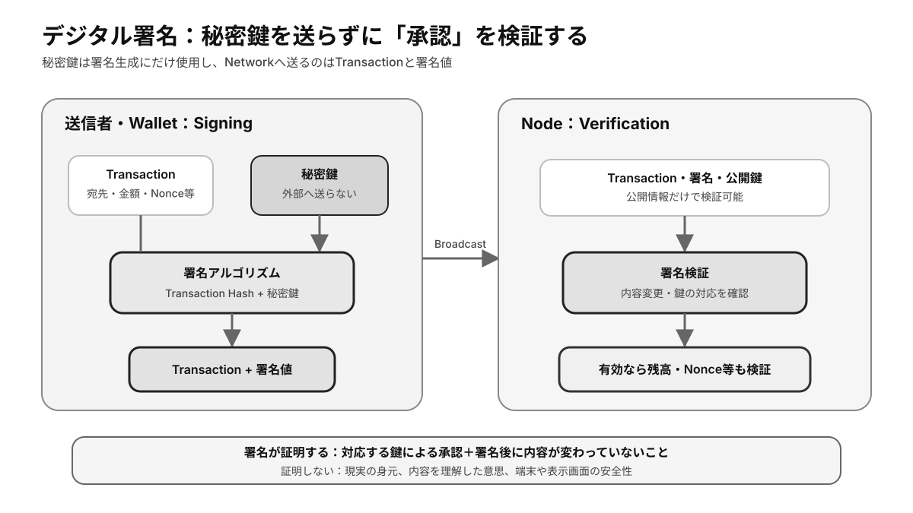

# 第4章 公開鍵・秘密鍵・デジタル署名 ★最重要

ブロックチェーンでは、本人確認機関に毎回問い合わせる代わりに、**公開鍵**暗号と**デジタル署名**によって操作権限を検証します。本章では鍵と署名の役割を理解し、「資産を持つ」とは技術的に何を意味するのかを考えます。

## この章の学習目標

- Private Key、Public Key、Addressの導出関係を説明できる。
- SigningとVerificationの流れ、および署名が証明する範囲を説明できる。
- 鍵の紛失・漏洩・第三者管理に対する適切な対策を選べる。

> **最重要ポイント:** Blockchainが認識するのは人の氏名ではなく、**有効な署名を作成できる鍵の支配**です。鍵の安全性と本人の意思確認は、Protocol外の運用で補う必要があります。

## 4.1 公開鍵暗号

### 4.1.1 Private Key

Private Key（**秘密鍵**）は、十分に大きな範囲から選ばれる推測困難な数値で、署名を作成するための最重要情報です。秘密鍵を知る者は、その鍵に対応する資産やコントラクト操作を承認できるため、第三者へ送信したり画面共有したりしてはいけません。

秘密鍵はパスワードと異なり、漏洩後に管理者へ連絡して無効化できるとは限りません。漏洩が疑われる場合は、安全な新しい鍵へ資産や権限を速やかに移す必要があります。

### 4.1.2 Public Key

Public Key（公開鍵）は、秘密鍵から一方向の計算で導出され、署名の検証に使われます。公開鍵から秘密鍵を現実的な時間で求められないことが、安全性の前提です。

多くのブロックチェーンでは、公開鍵をさらにハッシュ化・符号化した値をアドレスとして使います。公開鍵とアドレスは関連しますが、常に同一ではありません。

### 4.1.3 Key Pair

秘密鍵と公開鍵は、数学的に対応する**Key Pair**を構成します。秘密鍵で作った署名は対応する公開鍵で検証でき、別の秘密鍵では同じ有効な署名を作成できません。

鍵ペアの生成には、安全な乱数が不可欠です。予測可能な乱数や独自実装を使うと、暗号方式自体が強くても秘密鍵を推測される危険があります。

### 4.1.4 公開可能な情報と秘密にすべき情報

アドレス、公開鍵、トランザクションハッシュは、通常は他者と共有してよい情報です。ただし、公開台帳上の活動が結び付くため、アドレスの共有はプライバシー上の影響を持ちます。

秘密鍵、シードフレーズ、バックアップ、ウォレットの復元用データは秘密にすべき情報です。正規のサポート担当者やウォレット事業者が、これらを聞き出す必要はありません。

## 4.2 デジタル署名

*図4-1：秘密鍵をNetworkへ送らず、署名値と公開鍵から承認を検証する流れ*

### 4.2.1 Signing

Signingは、トランザクションなどのメッセージと秘密鍵を使って署名値を生成する処理です。秘密鍵そのものをネットワークへ送信するのではなく、署名済みデータだけを送ります。

署名対象には宛先、金額、チェーン識別子などが含まれます。ウォレットで承認する前に、どのデータへ署名するのかを確認することが重要です。

### 4.2.2 Verification

Verificationは、メッセージ、署名、公開鍵を使って署名の有効性を確認する処理です。各ノードが同じ検証を独立して行えるため、中央の認証サーバーがなくても不正なトランザクションを拒否できます。

検証に成功しても、その処理が残高やコントラクトのルールを満たすとは限りません。署名検証はトランザクション検証の一部です。

### 4.2.3 秘密鍵と署名の関係

有効な署名は、対応する秘密鍵を使える者が特定のデータを承認したことを示します。通常、署名から秘密鍵を導出することはできず、一つの署名を別内容のトランザクションへそのまま流用することもできません。

ただし、実装上の乱数生成ミスや同じ署名の不適切な再利用は秘密鍵漏洩につながることがあります。信頼できる標準実装を使うべき理由の一つです。

### 4.2.4 デジタル署名が証明するもの

デジタル署名が証明するのは、対象データが署名後に変わっておらず、対応する秘密鍵によって承認されたことです。署名者の法的身元、内容を理解したうえでの同意、取引相手の誠実さまでは保証しません。

ウォレットが表示した内容と実際の署名対象が一致しているかも重要です。端末やウォレットが侵害されていれば、利用者が意図しないデータへ正しく署名させられる可能性があります。

## 4.3 所有とコントロール

### 4.3.1 秘密鍵を持つ意味

秘密鍵を持つとは、対応するアドレスからの操作を自ら承認できることです。ブロックチェーン上の資産は鍵の内部に保存されるのではなく、台帳に記録され、その状態を変更する権限が鍵によって制御されます。

### 4.3.2 秘密鍵を失う意味

秘密鍵と復元手段を失うと、有効な署名を作れなくなり、資産が台帳上に存在していても移動できません。**Permissionless**なネットワークには、本人確認書類を提示して鍵を再発行する中央窓口が通常ありません。

このリスクに備え、復元情報を災害や盗難から守れる場所へ分散して保管します。ただし、複製を増やすほど漏洩経路も増えるため、可用性と機密性のバランスが必要です。

### 4.3.3 秘密鍵漏洩

秘密鍵が漏洩すると、攻撃者は正規の形式で署名できるため、ネットワークは所有者本人との区別ができません。送金後の取り消しが困難であることから、漏洩を検知する仕組みより予防が重要です。

高額資産では、ハードウェアウォレット、複数署名、**MPC**、権限分離、送金上限などを組み合わせ、単一の鍵や端末の侵害で全資産を失わない設計にします。

### 4.3.4 「Not your keys, not your coins」の意味

この言葉は、自分で秘密鍵を管理していない資産は、技術的にはカストディ事業者の操作権限下にあるという注意喚起です。事業者の停止、破綻、出金制限、侵害によって利用できなくなる可能性があります。

一方、自己管理には紛失や誤操作を自ら負担する責任があります。自己管理とカストディのどちらが常に優れるのではなく、金額、利用頻度、復旧能力、規制上の保護を踏まえて選択します。

## 検定対策：鍵のライフサイクル

### 鍵とAddressの関係

一般的な流れは `安全な乱数 → Private Key → Public Key → Address` です。矢印の逆方向を現実的に計算できないことが安全性の前提です。ただし、ChainによってAddressの導出式、Checksum、Public Keyの公開タイミングは異なります。

**Addressは秘密情報ではありません**が、Addressを本人情報と結び付けると、公開履歴から残高や取引相手を追跡されます。鍵の機密性と取引Privacyは別問題です。

### 署名・検証の手順

1. WalletがChain ID、Nonce、宛先、金額、Call Dataなどを直列化する。
2. 署名対象のHashを計算する。
3. Private Keyで署名値を生成する。
4. NodeがPublic Keyまたは署名から導出したSenderを使って署名を検証する。
5. 残高、Nonce、Contract条件など、署名以外の有効性も検証する。

Chain IDやNonceを署名対象へ含めるのは、別Chainや別時点で同じ署名を再利用する**Replay Attack**を防ぐためです。Protocolが何を署名対象へ含めるかは重要なセキュリティ仕様です。

### 鍵管理の三大リスク

| リスク | 結果 | 主な対策 |
|---|---|---|
| 紛失 | 正当な所有者も署名できない | Backup、複数拠点、復元訓練 |
| 漏洩 | 攻撃者が正規署名を作れる | Hardware Wallet、権限分離、用途別鍵 |
| 誤署名 | 意図しない操作を正規承認する | Clear Signing、Simulation、複数人確認 |

鍵を安全に保管していても、画面が偽の内容を表示すれば誤署名は起きます。**鍵を盗ませない対策**と**正しい内容だけへ署名する対策**を分けて設計します。

### 鍵のローテーションと失効

通常の個人Addressでは、Private Keyを同じAddressのまま交換できません。新しい鍵から新Addressを作り、資産を移します。一方、Smart Contract Walletでは、複数鍵、Recovery Guardian、日次上限、鍵交換機能をCodeで実現できます。

組織では、退職、端末紛失、漏洩疑いに備えて鍵の失効・交換手順を事前に定めます。管理者鍵を変更できないContractでは、長期運用リスクが高まります。

### 確認問題

1. Public Keyを公開すると、誰でも署名を作成できる。正しいか。
2. Digital Signatureが有効なら、署名者が内容を理解していたことまで証明できるか。
3. Private Key漏洩と紛失では、対応の優先事項はどう異なるか。

#### 解答と解説

1. **誤り。** Public Keyは検証用であり、署名生成にはPrivate Keyが必要。
2. **証明できない。** 有効な鍵で対象データが承認されたことを示すだけで、理解や自由意思はProtocol外の問題。
3. 漏洩時は**新しい安全な鍵へ資産・権限を移す**。紛失時はBackupやRecovery経路から操作能力を復元する。

## まとめ

秘密鍵は操作を承認し、公開鍵はその署名を検証します。ブロックチェーン上の所有は鍵を使えることと密接に結び付きますが、鍵管理には第三者へ委ねるリスクと自分で負うリスクの両方があります。
