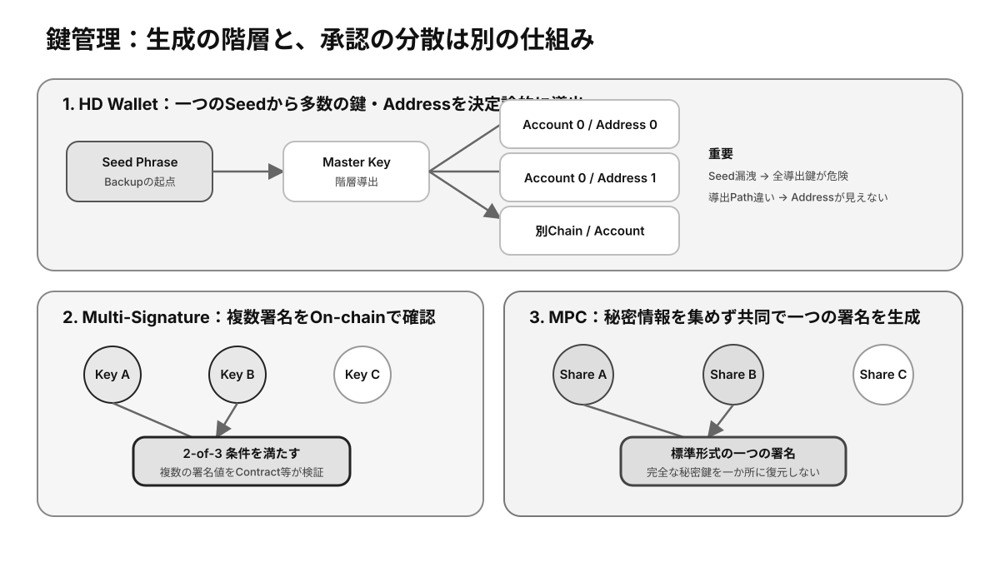

# 第5章 ウォレットとアドレス ★最重要

ウォレットは暗号資産そのものを格納する箱ではなく、鍵を管理し、ブロックチェーンとの操作を仲介する道具です。本章ではウォレットとアドレスの関係、分類方法、代表的な鍵管理方式を学びます。

## この章の学習目標

- Walletが保持するものと、Blockchain上に存在するものを区別できる。
- Hot / Cold、Custodial / Non-Custodial、Software / Hardwareを別の分類軸として説明できる。
- 保有額と用途に応じたBackup、Multi-Signature、MPCの選択基準を示せる。

> **最重要ポイント:** Walletに資産が入っているのではありません。**資産はBlockchainのStateにあり、WalletはそのStateを変更する鍵と署名機能を管理します。**

## 5.1 Wallet

### 5.1.1 Walletとは

Walletは、**秘密鍵**の生成・保管、アドレスの表示、残高照会、トランザクション作成と署名を行うソフトウェアまたは機器です。使いやすい画面を提供しますが、画面上の表示はブロックチェーン上の実態と一致しているか検証可能であることが望まれます。

ウォレットには鍵を自分で管理するものと、事業者が管理するものがあります。同じ「ウォレット」という名称でも信頼モデルが異なるため、復元方法と署名主体を確認する必要があります。

### 5.1.2 Blockchain Address

Blockchain Addressは、資産の送付先やアカウント、コントラクトを識別する文字列です。**公開鍵**などから導出されることが多く、チェーンごとに形式、長さ、チェックサムが異なります。

見た目が似たアドレスでも、異なるネットワークでは別の状態を指す場合があります。送金時はアドレスだけでなく、対象チェーン、資産、必要なメモやタグも確認します。

### 5.1.3 WalletとBlockchainの関係

ウォレットはノードやRPCサービスへ問い合わせ、ブロックチェーンの状態を読み取ります。送金時には端末内または署名機器でトランザクションへ署名し、ネットワークへ送信します。

ウォレットアプリを削除しても、ブロックチェーン上の記録は消えません。鍵またはシードフレーズを安全に復元できれば、互換性のある別ウォレットから同じ資産を操作できます。

### 5.1.4 残高はどこに存在するのか

残高はウォレット内部ではなく、ブロックチェーンが共有する状態として存在します。ウォレットはアドレスに関連する**UTXO**やアカウント状態を取得し、人が理解しやすい残高として表示します。

表示が更新されない場合でも、資産が消えたとは限りません。ネットワーク設定、同期状態、トークンの表示設定を確認し、必要ならブロックエクスプローラーで**オンチェーン**情報を照合します。

## 5.2 Walletの分類

### 5.2.1 Hot / Cold

Hot Walletは、秘密鍵をインターネットに接続し得る環境で利用するウォレットです。日常的な取引に便利ですが、マルウェア、フィッシング、端末侵害の影響を受けやすくなります。

Cold Walletは、鍵を通常はオフライン環境で保管・使用します。攻撃面を減らせますが、バックアップ紛失、物理的盗難、操作手順の複雑さへの対策が必要です。

### 5.2.2 Custodial / Non-Custodial

Custodial Walletでは、取引所などの事業者が利用者に代わって秘密鍵を管理します。パスワード再設定やサポートを利用できる一方、出金可否と資産保全を事業者へ依存します。

Non-Custodial Walletでは、利用者自身が鍵を管理します。第三者の承認なしに操作できますが、鍵の紛失、漏洩、誤署名の責任も自分で負います。「Self-Custody Wallet」と呼ばれることもあります。

### 5.2.3 Software / Hardware

Software Walletは、スマートフォン、ブラウザー、PCなどで動くアプリケーションです。導入しやすい反面、動作するOSや拡張機能、端末自体の安全性に依存します。

Hardware Walletは、秘密鍵を専用機器内に隔離し、署名処理を機器内で行います。ただし万能ではなく、画面確認を怠った署名、復元フレーズの漏洩、偽造品やサプライチェーン攻撃には注意が必要です。

### 5.2.4 分類軸の違い

Hot / Coldは主にネットワーク接続状態、Custodial / Non-Custodialは鍵の管理主体、Software / Hardwareは実装媒体を表します。これらは互いに排他的な一つの分類ではありません。

例えば取引所のモバイルアプリは、利用者から見ればSoftwareかつCustodialです。ハードウェアウォレットは一般にNon-CustodialかつCold寄りですが、接続方法や運用によってリスクは変わります。

## 5.3 鍵管理

*図5-1：Seedからの鍵導出と、Multi-Signature・MPCによる承認分散の違い*

### 5.3.1 Seed Phrase

**Seed Phrase**は、複数の単語で表現されたウォレット復元用の情報です。対応する方式では、一つのシードから多数の秘密鍵とアドレスを再生成できます。

シードフレーズを知る者はウォレット全体を復元できるため、写真、クラウドメモ、メールなど漏洩しやすい場所へ保存すべきではありません。入力を求めるWebサイトは原則として疑います。

### 5.3.2 HD Wallet

HD（Hierarchical Deterministic）Walletは、一つのシードから階層的に多数の鍵を決定論的に導出する方式です。用途やチェーンごとに別アドレスを使い分けながら、一つのバックアップで復元できます。

導出パスや規格が異なると、同じシードでも期待したアドレスが表示されないことがあります。復元手順を安全な少額環境で確認しておくと、緊急時の混乱を減らせます。

### 5.3.3 Multi-Signature

**Multi-Signature**は、資産操作に複数の鍵の承認を要求する仕組みです。例えば「3本中2本」の署名を必要にすれば、1本の紛失や漏洩だけで資産が失われるリスクを下げられます。

組織の資金管理や共同所有に適しますが、署名者の選定、鍵の地理的分散、障害時の復旧、コントラクトの安全性を事前に設計する必要があります。

### 5.3.4 MPC

**MPC**（Multi-Party Computation）を利用する署名では、秘密情報を複数の参加者や機器に分け、完全な秘密鍵を一か所へ集めずに署名を生成します。アクセス制御や復旧フローを柔軟に設計できる点が特徴です。

Multi-Signatureがオンチェーン上で複数署名を検証することが多いのに対し、MPCは外部から通常の単一署名に見える場合があります。ただし、実装や運営サービスへの依存も評価が必要です。

### 5.3.5 鍵管理とリスク

鍵管理では、機密性だけでなく、必要なときに利用できる可用性と、正しい操作だけを許可する**完全性**を考えます。一つのバックアップだけでは紛失に弱く、無制限のコピーは漏洩に弱くなります。

保有額と用途に応じて、日常用と保管用の分離、送金前の少額テスト、複数承認、定期的な復元訓練、相続・緊急時手順を組み合わせます。最も複雑な方式ではなく、継続して正しく運用できる方式を選ぶことが重要です。

## 検定対策：Wallet設計と復旧

### 分類軸のマトリクス

| 例 | 接続状態 | 鍵の管理主体 | 実装媒体 | 主なリスク |
|---|---|---|---|---|
| 取引所アプリ | Hot | Custodial | Software | 事業者停止、出金制限、Account乗っ取り |
| Browser Wallet | Hot | Non-Custodial | Software | Phishing、Malware、誤署名 |
| Hardware Wallet | Cold寄り | Non-Custodial | Hardware | Seed漏洩、偽機器、画面確認不足 |
| 組織のMPC Wallet | 構成次第 | 共同または事業者 | Software / Service | 実装、運営、Recovery Policy |
| 紙のSeed Backup | Offline | Non-Custodial | Physical | 火災、盗難、劣化、発見不能 |

「Hardware WalletだからCold」「Non-Custodialだから安全」と機械的に判断してはいけません。Hardware Walletを常時接続して不明な署名へ使えばHotに近いリスクを負い、Non-CustodialでもSeedをCloudへ保存すれば漏洩しやすくなります。**製品名より実際の運用を評価します。**

### Backup設計の原則

- **機密性:** 第三者がSeedや鍵を読めないこと。
- **可用性:** 災害、故障、本人死亡時にも正当な手順で復元できること。
- **完全性:** Backupが欠損・改ざんされず、正しいデータだと確認できること。
- **地理的分散:** 同一火災・水害・盗難で全Copyを失わないこと。
- **定期検証:** 本番資産を危険にさらさず、復元可能性を確認すること。

Backup枚数を増やすと可用性は上がりますが、漏洩経路も増えます。複数のShareへ分割する方式では、必要数を下回ると復元不能になり、Shareの置き場所と手順の管理が必要です。

### Multi-SignatureとMPCの比較

| 観点 | Multi-Signature | MPC |
|---|---|---|
| 承認の見え方 | 複数署名をOn-chainで検証 | 一つの署名として見える場合がある |
| Chain側の対応 | 対応ScriptやContractが必要 | 標準署名として利用できる場合がある |
| Policy | ContractやScriptに表れる | Off-chain Systemで管理する場合が多い |
| Privacy / Fee | 署名者数が見えFeeが増える場合 | 外部から構成が見えにくい場合 |
| 主な注意 | Contract、署名順、必要人数 | Protocol実装、Share Recovery、Service依存 |

どちらも単一障害点を減らせますが、承認者が同じ端末・同じCloud Accountを使えば共通障害が残ります。**鍵の数ではなく、管理主体と障害領域を分ける**ことが重要です。

### Address確認の実務

MalwareがClipboard内のAddressを攻撃者のものへ置換することがあります。また、攻撃者が過去の取引履歴へ似たAddressから少額送金し、履歴Copyを誘うAddress Poisoningもあります。直前履歴から安易にCopyせず、信頼できる登録先やQR Code、Hardware画面を照合します。

高額送金では、少額Test後も宛先を再確認します。攻撃者がTest後に表示を差し替える可能性があるためです。組織ではAddress Allowlistと変更時の待機期間を利用します。

### 確認問題

1. Walletアプリを削除すると、Blockchain上の資産も消える。正しいか。
2. Seed PhraseとWalletのログインPasswordでは、漏洩時の影響が一般にどう違うか。
3. 2-of-3 Multi-Signatureでは、何本の鍵まで紛失しても署名可能か。

#### 解答と解説

1. **誤り。** 資産はBlockchain上にあり、復元情報があれば別Walletから操作できる。
2. **Seed PhraseはWallet全体を復元できる最重要情報。** App Passwordだけなら端末内データ保護に限定される場合がある。
3. **1本。** 2本残れば署名できる。ただし2本を失うと復元不能になる。

## まとめ

ウォレットはブロックチェーン上の資産を操作するための鍵管理ツールです。分類名だけで安全性を判断せず、誰が鍵を持ち、どこで署名し、紛失・漏洩・誤操作からどう復旧するかを具体的に確認しましょう。
