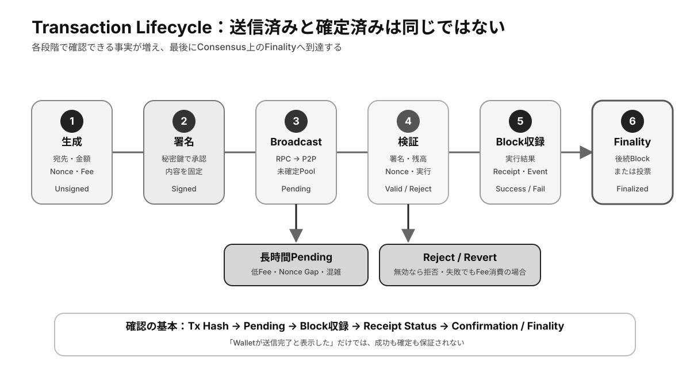

# 第6章 トランザクション ★最重要

トランザクションは、ブロックチェーンの状態を変更する基本単位です。本章では、利用者がウォレットで操作を始めてからネットワークで確定するまでの流れと、各段階で確認すべき状態を学びます。

## この章の学習目標

- Transactionの生成からFinalityまでを順序立てて説明できる。
- Pending、Included、Success、Failure、Finalizedを区別できる。
- Fee、Nonce、二重支払いの関係と、送信後の確認方法を説明できる。

> **最重要ポイント:** **署名した、送信した、Blockに収録された、実行に成功した、最終確定した**は、すべて別の状態です。

## 6.1 Transactionとは

### 6.1.1 Transactionの役割

Transactionは、資産の送付、スマートコントラクトの実行、データ記録などをネットワークへ要求するメッセージです。ノードは署名とプロトコル上の条件を検証し、有効なものをブロックへ収録します。

状態を変更しない単純なデータ参照は、通常トランザクションを必要としません。状態変更には全参加者が同じ結果へ到達する必要があるため、手数料と合意形成が伴います。

### 6.1.2 Sender / Recipient

Senderは操作を承認する送信元、Recipientは資産や呼び出しを受け取る宛先です。Recipientには個人のアドレスだけでなく、スマートコントラクトのアドレスも指定できます。

ブロックチェーンによっては、署名から送信者を導出します。取引所への入金では、共通アドレスに加えて利用者識別用のメモやタグが必要な場合があります。

### 6.1.3 Value

Valueは、トランザクションで移転するネイティブ資産の量などを表します。最小単位の整数として記録され、ウォレットが小数点を付けた表示へ変換することが一般的です。

トークン移転では、Valueがゼロでもコントラクトの関数引数として数量を指定する場合があります。画面上の表示だけでなく、呼び出し内容を区別することが大切です。

### 6.1.4 Fee

Feeは、トランザクションを処理・保存するネットワーク参加者へ支払う手数料です。必要な計算量、データ量、ネットワーク混雑、利用者が設定する優先度などによって変化します。

手数料は送金額とは別にネイティブ資産で必要になることが多く、失敗した実行でも計算資源を消費した分が請求される場合があります。

## 6.2 Transactionの流れ

*図6-1：Transaction生成からFinalityまでの段階と、途中で発生する主な状態*

### 6.2.1 Transaction生成

ウォレットは宛先、金額、手数料条件、連番、チェーン識別子、コントラクト呼び出しデータなどを組み立てます。連番は同じトランザクションの再利用や順序の混乱を防ぐ役割を持ちます。

この段階ではまだ署名されていないため、ネットワークは送信者の承認を確認できません。利用者は署名前に宛先と実行内容を確認します。

### 6.2.2 Signing

ウォレットは構築したトランザクションへ**秘密鍵**で署名します。署名後に対象データを変更すると検証に失敗するため、承認内容と署名が結び付きます。

署名は送信とは別の処理です。オフライン機器で署名し、署名済みデータを別のオンライン端末から送信することもできます。

### 6.2.3 Broadcast

署名済みトランザクションは接続先ノードへ送られ、P2Pネットワークを通じてほかのノードへ伝播します。最初のノードへ届いたことは、ブロックへの収録や成功を保証しません。

接続障害で送信できなかった場合、署名済みデータを再送できることがあります。ただし、同じ操作を新しい連番で重複作成しないよう状態を確認します。

### 6.2.4 Validation

各ノードは署名、残高、連番、手数料、データ形式、スマートコントラクトの実行条件などを検証します。無効なトランザクションは転送・収録候補から除外されます。

検証規則は全ノードが共有するプロトコルの一部です。この決定論的な規則によって、特定の管理者が個別に承認しなくても同じ結果を得られます。

### 6.2.5 Block Inclusion

ブロック提案者は、未収録トランザクションの集合からブロックへ含めるものを選びます。一般に、手数料の優先度、サイズ、依存するトランザクション、実行可能性などが選択に影響します。

ブロックへ入ると**オンチェーン**履歴になりますが、直後はチェーン再編の可能性が残る場合があります。

### 6.2.6 Confirmation / Finality

Confirmationは、対象トランザクションを含むブロックの後ろに、さらにブロックが積み重なった度合いを示します。確認数が増えるほど、一般に履歴が置き換わる可能性は低くなります。

**Finality**は、プロトコル上その履歴が覆らない、または覆すことが極めて困難になった状態です。確率的Finalityと明示的なFinalityがあり、必要な待機基準はチェーンと取引リスクによって異なります。

## 6.3 Transactionの状態

### 6.3.1 未確定

未確定（Pending）は、ネットワークへ伝播したものの、まだ正規ブロックへ収録されていない状態です。混雑、低い手数料、同一アカウントの前の連番待ちなどで長引くことがあります。

### 6.3.2 成功

成功は、トランザクションがブロックへ収録され、要求した状態変更がルールどおり完了した状態です。十分なFinalityを得るまでは、用途に応じた確認数を待ちます。

トークン移転などでは、トランザクション自体の成功に加えて、イベントや残高差分が期待どおりかも確認します。

### 6.3.3 失敗

失敗は、ブロックへ収録されたものの、実行中に条件違反や計算資源不足が発生し、意図した状態変更が完了しなかった状態です。多くの場合、状態変更は巻き戻されても手数料は戻りません。

署名前のシミュレーションは失敗を減らしますが、実行時までに状態が変わると結果も変わり得ます。

### 6.3.4 Transaction Hash

**Transaction Hash**は、送信後の追跡に使う識別子です。エクスプローラーで状態、ブロック番号、送信元、宛先、手数料、イベントなどを確認できます。

問い合わせ時に共有すると便利ですが、Tx Hashだけでは資金を取り戻したりトランザクションを取り消したりできません。

### 6.3.5 二重支払い

**二重支払い**は、同じ資産を複数の相手へ同時に使おうとする問題です。ブロックチェーンは**UTXO**の消費状態やアカウントの連番を検証し、合意された履歴では一方だけを有効にします。

未確定の受領を即座に確定扱いすると、競合するトランザクションやチェーン再編の影響を受けます。高額取引ほど十分な確認またはFinalityを待つ必要があります。

## 検定対策：Transactionを状態機械として理解する

### Lifecycleと確認項目

| 段階 | 状態 | 確認できるもの | 主な失敗 |
|---|---|---|---|
| 生成 | Unsigned | 宛先、Value、Nonce、Fee条件 | Chainや単位の指定ミス |
| 署名 | Signed | 署名と内容の対応 | 誤署名、Replay対策不足 |
| 伝播 | Broadcast / Pending | Tx Hash、Nodeの受付 | 通信失敗、低Fee、Nonce Gap |
| 収録 | Included | Block Number、Index | 一時的なReorg |
| 実行 | Success / Revert | Receipt、Gas、Event | 条件違反、Gas不足 |
| 確定 | Finalized | Finality基準 | Consensus上の重大障害 |

Walletが「送信完了」と表示しても、RPCが受け付けただけの場合があります。Explorerで見つからなければ伝播前、Pendingなら未収録、StatusがFailureなら収録済みでもState変更は不成立です。**表示文言ではなくOn-chainの段階を確認します。**

### Feeの構成

多くのSmart Contract Chainでは、Feeは概念的に「消費した計算資源 × 単価」で求められます。利用者が設定する上限は最大支払額であり、必ず上限全額を支払うとは限りません。基本FeeをBurnし、優先FeeをBlock提案者へ渡す設計もあります。

UTXO系ではTransactionのByte SizeとFee Rateが重要になります。入力UTXOが多いほどData Sizeが増え、送金額が小さくてもFeeが高くなる場合があります。**Feeは送金額の割合ではなく、Network資源の消費量と需要で決まる**ことが基本です。

### NonceとTransaction置換

Account Modelでは、同じSenderのTransactionへ連続したNonceを付けます。Nonce 10が未収録の間、Nonce 11以降が待機することをNonce Gapと呼ぶ場合があります。

同じNonceでより高いFeeのTransactionを送ると、未確定Transactionを置換できるChainがあります。自分自身へ0を送るTransactionで取消を試みる方法も、実際には「元Transactionより先に別Transactionを収録させる競争」です。**一度Blockへ収録・確定したTransactionを取り消す機能ではありません。**

### ReceiptとEventの読み方

Receiptには、Success / Failure、消費した計算資源、Event Log、作成されたContract Addressなどが記録されます。Inputは「要求」、Receiptは「実行結果」です。

Token TransferはEventから表示されることが多い一方、Protocol内部の残高差分やNative Assetの内部移動は別表示になる場合があります。調査では、`Transaction → Receipt → Event → State差分` の順に追います。

### 二重支払いへの対処

UTXO Modelは同じOutputの再消費を、Account ModelはNonceの再利用と残高不足を拒否します。しかし、未確定状態では競合候補が存在できます。店舗などが0 Confirmationで受領を確定すると、より高いFeeの競合Transactionへ置換されるリスクがあります。

受領基準は、金額、商品を取り戻せるか、ChainのBlock間隔、Finality方式、攻撃価値に応じて定めます。

### 確認問題

1. FailureになったTransactionでは、必ずFeeも全額返却される。正しいか。
2. Tx Hashが発行された時点で、資産移転は確定したといえるか。
3. 同じSenderからの後続TransactionがPendingのままになる原因を、Nonceの観点から一つ挙げよ。

#### 解答と解説

1. **誤り。** 実行に使ったNetwork資源へのFeeは支払う場合が多い。
2. **いえない。** 署名済みデータの識別子を得ただけの場合があり、収録・成功・Finalityを別途確認する。
3. **小さいNonceのTransactionが未収録であるNonce Gap。** 前のTransactionを収録または置換する必要がある。

## まとめ

トランザクションは、生成、署名、伝播、検証、ブロック収録、確定という段階を進みます。署名済み、送信済み、成功、確定は別々の状態であり、Tx Hashを使って実際のオンチェーン結果を確認する習慣が重要です。
