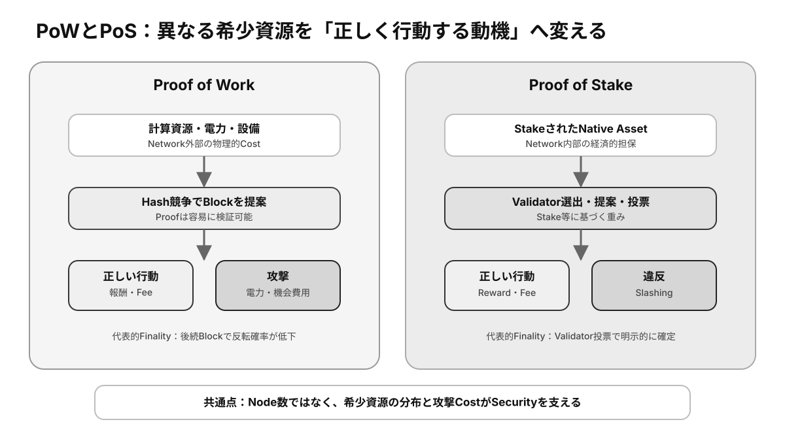

# 第8章 コンセンサス ★重要

分散ネットワークでは、参加者が異なる順序で情報を受け取り、一部が停止または不正動作することもあります。**Consensus**は、その状況でも正規の履歴を一つに決めるための規則と手続きです。

## この章の学習目標

- Consensusが安全性と進行性を両立させる仕組みだと説明できる。
- PoWとPoSを、希少資源、報酬、攻撃コスト、Finalityから比較できる。
- Fork、Reorg、Finalityの違いと、取引確定基準への影響を説明できる。

> **最重要ポイント:** Consensusは正しいTransactionを多数決で決めるのではなく、**有効なBlock候補の中から正規の順序へ収束するための規則**です。

## 8.1 Consensus

### 8.1.1 Consensusとは

Consensus（合意形成）は、複数ノードがどのブロックと状態を正しい履歴として採用するかを決める仕組みです。ブロック提案者の選択、投票や重み付け、分岐選択、報酬と罰則などを組み合わせます。

合意形成は、トランザクション自体の有効性検証とは別です。有効な候補が複数あるとき、どの順序を正規とするかを決めます。

### 8.1.2 なぜ合意形成が必要なのか

ネットワーク遅延により、異なるノードが同時に別の有効トランザクションやブロックを見ることがあります。中央の時計や管理者がいないため、共通規則がなければ残高や取引順序が参加者ごとに分かれてしまいます。

合意形成は**二重支払い**を防ぎ、全参加者が同じ状態へ収束する基盤になります。

### 8.1.3 Byzantine Fault

Byzantine Faultは、ノードが停止するだけでなく、矛盾する情報を相手ごとに送るなど任意の不正動作をする故障モデルです。分散合意は、一定範囲の悪意ある参加者がいても安全性と進行性を保つことを目指します。

許容できる不正参加者の割合や、ネットワーク遅延に関する前提は方式ごとに異なります。保証を理解するには、アルゴリズム名だけでなく前提条件を確認します。

### 8.1.4 Finality

**Finality**は、一度確定した履歴が後から覆らない性質です。PoW系では後続ブロックが増えるほど覆る確率が下がる確率的Finalityが一般的です。

一部のPoS系では、一定数の**Validator**投票によってチェックポイントを明示的に確定します。ただし、実装不具合や社会的な緊急対応まで含めた絶対的な不可逆性とは区別が必要です。

## 8.2 Proof of Work

*図8-1：PoWとPoSが異なる希少資源をBlock提案、報酬、攻撃コストへ変換する仕組み*

### 8.2.1 Mining

Miningは、ブロック候補に対して条件を満たすハッシュ値を見つける計算を繰り返す作業です。最初に有効な解を見つけた**Miner**がブロックを提案し、ほかのノードはその証明を容易に検証できます。

### 8.2.2 計算資源

PoWでは、ブロック提案の影響力を計算資源と電力消費に結び付けます。攻撃者が履歴を書き換えるには、正規ネットワークに対抗できる継続的な計算力が必要です。

計算量の難易度は、ブロック生成間隔が目標へ近づくよう調整されます。高い安全性の代わりに、エネルギー消費と専用設備への集中が課題になります。

### 8.2.3 インセンティブ

Minerは、ブロック報酬とトランザクション手数料を得ることで、設備と電力の費用を負担します。正しいチェーンを延長する方が収益を得やすいよう設計し、経済合理性をネットワーク安全性へ結び付けます。

報酬水準、市場価格、手数料需要が下がれば、投入される計算力も変化します。セキュリティ予算は固定ではありません。

### 8.2.4 攻撃耐性

攻撃者が多数の計算力を得ると、最近の履歴を再構成したり自分の取引を二重支払いしたりできる可能性があります。ただし、他者の有効な署名を偽造したり、プロトコル規則に反する資産を作ったりはできません。

攻撃コスト、利益、検出後の市場影響を含めて抑止力が成立します。分散したハッシュレートと十分な経済規模が重要です。

## 8.3 Proof of Stake

### 8.3.1 Stake

Stakeは、Validatorがプロトコルへ預け入れる資産です。ブロック提案や投票の重みをステークへ結び付け、不正時に失う価値を担保にします。

ステーク量だけで単純に全てが決まるとは限らず、提案者選択にはランダム性や委任、上限などが組み込まれる場合があります。

### 8.3.2 Validator

Validatorは、ブロックの提案・検証・投票を担う参加者です。正しいソフトウェアを安定稼働させ、鍵を安全に管理し、規定時間内に参加する必要があります。

Validatorの運営主体やステークが少数へ集中すると、検閲や障害の共通化につながります。

### 8.3.3 Reward

Validatorは、正しくオンラインで合意形成へ参加した対価として新規発行資産や手数料を受け取ります。報酬は安全性維持の費用であり、発行による希薄化や利用者手数料によって支えられます。

表示利回りだけでなく、資産価格、インフレ率、ロック期間、運営手数料を含めて実質的な収益を評価します。

### 8.3.4 Slashing

**Slashing**は、二重署名や矛盾する投票などの違反に対して、ステークの一部または全部を没収する罰則です。不正行為の利益より損失を大きくし、経済的に抑止します。

単純な停止には軽い罰則、故意と判断できる違反には重い罰則を設ける場合があります。運用者は設定ミスや二重稼働でも罰則を受け得ます。

### 8.3.5 PoWとの思想的な違い

PoWは外部の計算資源とエネルギーを投入させ、履歴の作り直しに物理的コストを課します。PoSはネットワーク内部の資産を担保にし、不正時に没収できる経済的コストを課します。

どちらも「多数の端末」そのものではなく、希少資源に基づいて影響力を測ります。安全性は方式名だけで決まらず、分布、実装、報酬設計、運用参加者に依存します。

## 検定対策：安全性・進行性・経済性

### SafetyとLiveness

**Safety（安全性）**は、正直なNodeが矛盾する二つの履歴を同時に確定しない性質です。**Liveness（進行性）**は、有効なTransactionが最終的に処理され、Networkが前へ進む性質です。

Networkが大きく分断された場合、安全性を優先するProtocolは一時停止して矛盾した確定を避けることがあります。進行性を優先すれば双方が進み、後で片方を破棄する可能性があります。**停止しないことだけが安全なConsensusの条件ではありません。**

### ForkとReorg

Forkは、複数の有効Blockが同じ親から提案される一時的分岐、または互換性のないProtocol変更による恒久分岐を指します。一時Forkで正規枝が選ばれ、別枝のBlockが外れることをReorganization（Reorg）と呼びます。

ReorgされたBlock内のTransactionは、未確定へ戻るか別Blockへ再収録されます。このため、最新Blockに含まれただけのTransactionにはFinality待ちが必要です。

### PoWとPoSの比較

| 観点 | Proof of Work | Proof of Stake |
|---|---|---|
| 希少資源 | 計算力・電力・設備 | Stakeされた資産 |
| Block提案 | Hash計算競争 | Stake等に基づく選出 |
| 不正コスト | 外部資源の継続消費 | StakeのSlashing、価値下落 |
| Finality | 確率的が代表的 | 投票による明示的確定を持つ場合 |
| 主な集中要因 | ASIC、電力、Mining Pool | 大口保有、委任先、Staking Service |
| 主な運用リスク | 設備停止、収益性 | 鍵二重利用、Slashing、長期攻撃 |

PoSは電力消費を抑えられますが、資産集中やGovernanceとの結び付きが課題です。PoWは物理的コストを持ちますが、計算資源とPoolの集中が起こり得ます。**方式名ではなく、実際の資源分布を評価します。**

### 攻撃者ができること・できないこと

Consensus上の大きな影響力を持つ攻撃者は、Transactionの検閲、順序変更、自分の最近の支払いのReorgを試みられます。しかし、暗号方式が安全なら、他人のPrivate Keyによる署名の偽造や、Full Nodeの規則に反する無制限発行はできません。

一方、ProtocolのGovernanceやClient Softwareまで掌握すれば、将来の規則変更を促す社会的攻撃が可能です。Technical ConsensusとSocial Consensusの境界を意識します。

### Economic Finality

明示的Finalityを破るために多数ValidatorのSlashingが必要なら、履歴反転には測定可能な経済損失が伴います。これをEconomic Finalityとして評価できます。ただしStake資産の市場流動性、攻撃による価格下落、社会的Recoveryの可能性も影響します。

### 確認問題

1. Consensusでは、多数派が署名のないTransactionを有効にできる。正しいか。
2. SafetyとLivenessの違いを述べよ。
3. PoSでValidatorが故意に矛盾する投票を行うことを抑止する代表的仕組みは何か。

#### 解答と解説

1. **誤り。** Full Nodeの有効性規則に反するTransactionは多数派でも通常受け入れられない。
2. **Safetyは矛盾確定を防ぐ性質、Livenessは処理が前進する性質。** 分断時に両者のTrade-offが現れる。
3. **Slashing。** 預けたStakeを失わせ、不正利益より損失を大きくする。

## まとめ

Consensusは、遅延や不正がある分散環境で正規履歴を決める仕組みです。PoWは計算資源、PoSは担保資産を攻撃コストへ変換します。Finalityの意味と各方式の前提を理解して、確定性を判断する必要があります。
